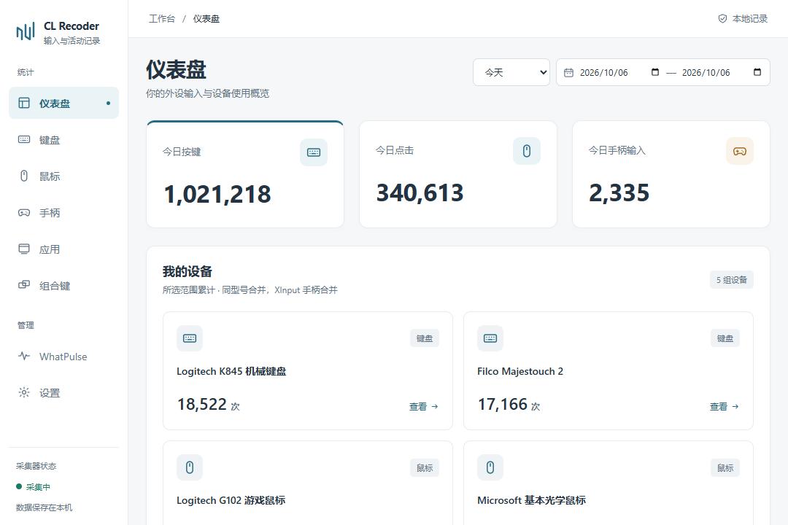

# CL Recoder

Windows 本地输入与活动记录工具。统计键盘、鼠标、XInput 手柄和前台应用的使用情况，数据保存在本机，可导出 CSV / JSON，无需账号或云同步。



## 功能

- **键盘**：按设备型号记录每日按键次数，提供参考键位布局、完整明细和组合键排行；长按自动重复不重复计数。
- **鼠标**：按物理来源记录移动量与 DPI，估算移动距离；按键、侧键与四向滚轮分别计数。
- **手柄**：XInput / Xbox 按键统计，明确区分 X/Y、LB/LT/RB/RT；左右摇杆提供停留时间热力图、活动时长及累计行程。
- **应用**：前台使用时长和应用内按键、点击次数，时长按小时、分钟和秒展示。
- **统计界面**：统一浅色界面，默认展示今日数据，可选择日期区间；完整记录支持排序和分页。
- **历史与导出**：WhatPulse 数据只读导入为独立历史快照，不混入本软件统计；支持 CSV / JSON 导出。

### 鼠标 DPI 与距离

移动距离使用鼠标的原始移动量和对应时间段的 DPI 换算，不根据屏幕光标位移估算。当前自动探测仅覆盖部分 USB 直连、支持 HID++ 2.0 / Adjustable DPI 功能的 Logitech 鼠标；其他设备可在鼠标页填写驱动中的当前 DPI。

- DPI 必须与鼠标当前档位一致，距离仍属于估算值。
- 同型号鼠标的运动数据、DPI 可按来源区分；按钮统计仍按型号合并。
- 未配置 DPI 的移动量保留原始计数，不冒充为零距离。覆盖不完整时显示已配置部分及覆盖率。
- 修改 DPI 只影响之后的采集，不重算历史；旧算法的移动量单独保留，不与新距离混合。

### 摇杆统计

热力图展示每个位置的停留时间，左右摇杆使用共同色标，支持点选和键盘查看精确数值。行程单位 **R** 表示摇杆从中心到满幅边缘的距离，不是厘米或米；从中心推到边缘再回中心约为 2 R。

## 下载与首次使用

从 [Releases](https://github.com/1781415302/cl-recoder/releases) 下载 Windows x64 安装包或便携 ZIP。

1. 运行安装包；使用便携版时，将 ZIP **完整解压**到固定目录，再运行 `cl-recoder.exe`。
2. 首次启动会显示界面。打开设置，启用采集器自启，并确认一次 UAC 授权。采集器通过计划任务 `ClRecoderCollector` 在用户登录时以最高权限启动。
3. GUI 自启可在设置或托盘菜单中单独开启。之后程序常驻托盘：左键打开界面，窗口右上角 **× 只隐藏窗口**，托盘菜单中的“退出”才结束 GUI。

采集器是独立进程，关闭或退出 GUI 不会停止采集。可在设置或托盘菜单暂停／恢复统计。采集器未运行时，设置页可检查并启动；自启策略异常时可修复为无执行时限、允许电池供电启动、切换到电池时继续运行。

**运行要求**：Windows 10 / 11 x64，以及 Microsoft Edge WebView2 Runtime。Windows 10 上可能需要另外安装；安装包会按 Tauri 的默认安装流程处理缺失的运行时，便携版请先安装 [WebView2 Evergreen Runtime](https://developer.microsoft.com/microsoft-edge/webview2/)。

发布产物未进行代码签名。Windows 可能显示未知发布者提示；请从本仓库的 Release 下载。

## 白屏兼容与恢复

Windows GUI 使用仅作用于本软件的 WebView2 软件渲染兼容路径，可能增加界面渲染的 CPU 开销。发生浏览器或主页面渲染进程崩溃时，软件会重建界面；隐藏或最小化时等待下一次打开，连续失败会停止自动重试并显示提示。可见界面长时间未完成初始化时，也会进入有界恢复流程。

此处理不修改 RTSS 或其他叠加层设置，也不能保证阻止外部 DLL 注入。若反复出现白屏，可从托盘退出 GUI 后重新打开，并通过设置中的诊断日志定位原因；后台采集独立运行。

## 数据与升级

| 内容 | 位置 |
|---|---|
| 统计数据库及 WAL 文件 | `%LOCALAPPDATA%\ClRecoder\stats.db`、`stats.db-wal`、`stats.db-shm` |
| GUI 设置 | `%LOCALAPPDATA%\ClRecoder\settings.json` |
| 本地诊断日志 | `%LOCALAPPDATA%\ClRecoder\logs\` |

统计数据长期保留，卸载 GUI 不会自动删除数据目录。日志采用大小限制和轮转。

升级前从托盘退出 GUI，并正常停止旧采集器，避免替换仍被占用的程序。在程序目录运行下面的命令；它通过本地控制管道请求退出并等待收尾写入，不强杀进程：

```powershell
powershell -NoProfile -ExecutionPolicy Bypass -File .\scripts\stop-collector.ps1
```

安装版运行新版安装包；便携版在原目录替换完整程序文件。数据目录与程序目录分离，升级时不要删除统计数据库。若改变程序目录（例如便携版改用安装版），先停用旧采集器自启并运行停止脚本，再在新 GUI 中重新启用自启，建立指向新路径的任务。更新后在 GUI 设置中检查并启动采集器。

**停用采集器自启只删除计划任务，不会结束当前采集器；暂停统计也不等于退出进程。** 删除、移动或备份数据库前，应先确认采集器已停止。需要备份时保留数据库及其未合并的 WAL 文件，不要直接删除损坏或被占用的数据库。

## 卸载

1. 在设置中停用采集器自启，并正常停止正在运行的采集器。
2. 关闭 GUI 自启，从托盘退出 GUI，再通过 Windows 应用管理卸载安装版；便携版可删除解压目录。
3. 不再需要历史记录时，再手动删除 `%LOCALAPPDATA%\ClRecoder\`。

## 已知边界

- 锁屏、登录界面和 UAC 安全桌面的输入不在普通采集桌面内，无法统计。
- 键盘和按钮计数按设备型号合并，不代表每一只同型号外设的独立按钮计数。
- 手柄仅支持 XInput；所有 XInput 手柄合并统计。Guide 键可能被系统接管，部分 PS / Switch 手柄需要外部 XInput 映射才能被识别。
- 摇杆的 R 行程是归一化轨迹长度，不是手指或摇杆帽的物理距离。
- 前台应用时长反映窗口位于前台的时间，不等同于用户持续操作或有效工作时间。

## 从源码构建

需要 Rust stable、Node.js 18+、Windows MSVC C++ 构建工具及 WebView2 Runtime。Rust 工具链配置见 `rust-toolchain.toml`；NSIS 工具由 Tauri CLI 按需下载。

在仓库根目录使用 PowerShell 7：

```powershell
npm --prefix ui ci
cargo test --workspace --locked
npm --prefix ui test

# 安装包需要先生成采集器资源
cargo build --release -p clrecoder-collector --locked
npx --yes @tauri-apps/cli@2.12.0 build
```

安装包输出到 `target/release/bundle/nsis/`。GUI、采集器和资源脚本必须一起分发，不能只复制 GUI exe。

```powershell
# 前端预览使用演示数据，不连接真实统计库
npm --prefix ui run dev

# 实际 GUI 开发模式
npx --yes @tauri-apps/cli@2.12.0 dev
```

## 架构

`cl-recoder-collector.exe` 负责采集与 SQLite 写入，`cl-recoder.exe` 负责展示、导入、导出和控制。两者通过本地 SQLite 与命名管道交互。详细设计及既往验收记录见 [docs](https://github.com/1781415302/cl-recoder/tree/main/docs)。
