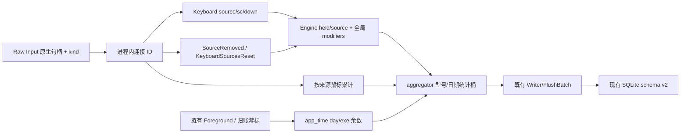

# CL Recoder 正确性修复实施方案

日期：2026-09-30。用途：交给独立 context 的 Coding Agent，由 workflow 按第 8 节调度。本文只提供设计与验收合同，不提供实现代码或编排脚本。

项目根目录：`C:\Users\17814\Documents\cl recoder`。文中源码路径均相对于此根目录；所有 Windows 命令使用 `pwsh`。工作基线为当前工作树，包含已有未提交修改，不是初始 commit。

**文档优先级**：本次需求及本文 > 当前实现事实 > `docs/DEVPLAN-remediation.md` > `docs/PLAN.md`。本文只覆盖明确列出的合同；未覆盖的旧约束继续有效。禁止依照旧文档恢复已经完成的修复。

## 1. 整体设计理念

### 1.1 核心目标与可验证结果

| 编号 | 修复目标 | 已确认的反例 | 修复后结果 |
|---|---|---|---|
| F1 / P1 | 拒绝无效 WhatPulse 来源，保护已有镜像 | 不相关 SQLite 文件导入返回成功，按键总数 27 → 0 | 返回 `ok=false`；目标库、七张 `wp_*` 表及 meta 不变 |
| F2 / P1 | 常驻采集器直启不等待其退出 | 无计划任务时进入 runas `-Wait`，启动一直处理中 | 启动请求完成后探测管道，成功释放启动锁 |
| F3 / P2 | 键盘按下状态按物理连接隔离 | A 按住 A，B 再按 A，只计一次 | 各来源计一次；同来源 repeat 仍去重；跨键盘修饰键仍有效 |
| F4 / P2 | 应用时长零头不串应用/日期 | A 400ms、B 600ms 循环 20 次记为 0/20 秒 | A=8 秒、B=12 秒；暂停与 flush 不清除合法余数 |
| F5 / P2 | 鼠标滚轮和移动累计按连接隔离 | 两鼠标各 +60 合成一格，记给后者 | 各自不足一格均不产事件；累计和移除互不影响 |
| F6 / P2 | JSON 每条输入记录保留设备归属 | 多设备记录平铺，但没有设备外键 | `input_daily[].deviceId` 可关联 `devices[].id` |
| F7 / P2 | WP 鼠标排行缓存与日期绑定 | 改日期只刷新其他视图，排行使用旧结果 | 日期和 limit 变化产生独立缓存键并发起正确查询 |

上一轮原有 186 个 Rust 单测、Clippy、前端构建、Tauri 调试构建通过；其中 F1/F3/F4/F5/F6 已在临时副本用五个反例复现，F2/F7 另有进程等待和 QueryObserver 验证。这是问题证据，不是本次实施已完成。

### 1.2 明确采用的方案

保持两进程和现有数据库：提权 collector 做采集/聚合/写入，普通权限 Tauri GUI 做查询、导入、导出与控制。修复放在现有责任边界内；不新增服务、不改 SQLite schema、不引入依赖。

设备有两种身份：**物理连接身份**用于瞬时状态，**设备型号身份 `DeviceKey`**用于持久统计。同型号设备仍归并到一行，但按下去重、滚轮余数必须先在物理连接内完成。连接生命周期是该方案的一部分，不能只加一个字段而遗漏拔出和线程重建。

WhatPulse 导入保持合法快照整体替换，先验证复制后的来源，再准备完整批次，最后复用 store 的原子替换事务。有效空库与无法读取的库必须区别对待，不能用“行数为零”判断失败。

应用时长采用独立纯计算模块，以 `(本地日期, exe)` 保存亚秒余数；产出整数秒后进入既有聚合桶，复用已有 flush 重试。导出采用专用 DTO，避免扩大 GUI 查询 DTO。前端仅提取很小的查询配置工厂，使真实生产缓存键可用既有依赖测试。

### 1.3 扩展性与设计原则

1. 输入来源 ID 不携带 Win32 类型、不入库、不进入 GUI/控制协议。将来替换输入后端仍可复用纯 Engine。
2. 全局组合键由所有来源仍按住的修饰键集合决定；不能把每个键盘完全独立的 Engine 当作最终方案。
3. 输入计数以物理按下边沿为准；键盘抬起、设备移除、来源重置只维护状态。
4. 无效来源与读取异常必须在目标库打开/迁移/删除之前退出。目标写入失败继续由现有事务回滚保护。
5. WhatPulse 源目录只读；保持主库 + best-effort WAL 的复制策略，不复制 SHM，不新增 Backup API feature。
6. 计数、标签、型号归并、日期闭区间、暂停期维护键盘状态、失败保留 flush 桶的现有语义继续有效。
7. 新测试必须隔离本机真实库、UAC、计划任务和生产管道。不是所有旧测试都适合无人值守执行，见第 8 节。
8. 仅增加必要回归：覆盖真实反例与新生命周期边界，不引入通用框架或顺手重构。

## 2. 系统架构设计

### 2.1 模块与职责

| 模块 | 本次职责 | 明确禁止 |
|---|---|---|
| `core::event` | 定义纯 `InputSourceId`；内部键盘事件带来源；提供来源移除/重置事件 | OS API、持久化、GUI DTO、改变 `core::ipc` |
| `engine` | 按 `(source, sc)` 去重；跨来源合并修饰位；来源清理 | 日期/应用/数据库/鼠标逻辑 |
| collector `raw_input` | 将原生句柄与 kind 映射为连接 ID；按来源累计鼠标；通知移除和重建 | 改数据库设备唯一键；把原生指针跨线程传递 |
| collector `device` | 保留型号解析；增加指定句柄的缓存失效 | 决定 Engine 状态或保存输入计数 |
| collector `engine_loop` | 消费生命周期与带来源输入；把时间增量放入现有桶 | 把生命周期算成输入事件；重写 Writer/查询层 |
| 新 collector `app_time` | 纯函数拆分日期、按 `(day,exe)` 累计 Duration 余数、返回整数秒增量 | 调用 `Local::now`/Instant/IO；直接写 SQLite |
| GUI `commands::import` | 复制副本的结构与读取验证；组织可靠批次 | 接受读取错误为空快照；直接写 SQL 到 `wp_*` |
| GUI `commands::collector_ctl` | 为常驻 exe 单独构造无 Wait 的启动命令；沿用管道就绪判断 | 删除有限安装/卸载脚本的 Wait；重构 IPC/自启 |
| GUI `commands::export` | 本文件专用带外键 DTO；导出格式版本 2 | 改公共 `KeyDailyRowLabeled`、reader、SQLite 版本 |
| 新 UI `api/wpMouseQuery` | 创建包含日期/limit 的 queryKey 和绑定同参数的 queryFn | 导入 client、访问 Tauri/环境、聚合数据 |
| UI `WhatPulse` | 使用上述工厂；保持前缀失效机制 | 用全局 refetch/staleTime 掩盖错误缓存键 |

### 2.2 数据流



GUI 导入流：路径解析 → 复制副本 → 完整性/表列验证 → 可识别统计数据全部读取 → `WpImportBatch` → `open_rw`/migrate → `rebuild_wp_tables_with`。失败报告沿用现有 `ImportReport`。

导出流：现有 ro 连接 → 每个设备现有 labeled daily 查询 → 加 `deviceId` → 版本 2 JSON。WP 查询流：Range/limit → 工厂 → React Query → 现有 client → 既有 Tauri command。

### 2.3 必须保留的边界

- `DeviceKey{kind,vid,pid,name}` 与 `devices` 唯一键完全不变；物理来源不可用 `DeviceKey` 代替。
- `RawEvent/AggEvent` 是本进程内部 channel 契约，并非 named-pipe 线协议；新变体不要求 GUI 同步升级。
- 鼠标到 aggregator 前已是归属明确的计数/距离增量，因此不增加 `MouseClick/MouseMove` 的 source 字段。
- `FgState` 仍由 apps 管理当前 exe；亚秒余数不放 apps 或 AppState。时长误差中既有“事件消费时刻而非 OS 回调时刻”语义不在本次扩大修正。
- store 的 SQL、原子重建、增量 flush、GUI ro/rw 策略全部复用；没有必须修改 store/db/state 的理由。

## 3. 文件级设计

下表是允许修改/新增的完整清单。`docs/DEVPLAN-correctness-v2.md` 为本次交付文档，实施 Agent 不得自行改变其中架构合同；评审裁决记录另见同目录文档。

| 文件 | 操作与作用 | 为什么需要、与其他文件的关系 | 暴露接口/负责 Stage |
|---|---|---|---|
| `crates/core/src/event.rs` | 修改内部事件契约和 serde 测试 | Engine/producer/consumer 共同的来源类型 | §4.1，S1 |
| `crates/engine/src/lib.rs` | 修改 held 维度，新增来源 API与测试 | 纯输入状态机，来源类型来自 core | §4.2，S1 |
| `crates/collector/src/device.rs` | 新增按句柄失效及测试 | raw_input 移除通知必须同步清除型号解析缓存 | §4.3，S2 |
| `crates/collector/src/raw_input.rs` | 连接 ID、鼠标状态、设备通知、重建清理及测试 | 对接 Win32 与新 core 事件，保持外部 spawn | §4.3，S2 |
| `crates/collector/src/selftest.rs` | 补 source 构造/新事件匹配，保持输出格式 | enum 扩展后穷尽匹配和注入编译必须适配 | §4.3，S2 |
| `crates/collector/src/engine_loop.rs` | S2 接线新 Engine/生命周期；S4 接线时长 ledger | 新事件唯一 consumer、统计桶唯一归属 | §4.4，S2 后 S4；禁止并行写此文件 |
| `crates/collector/src/app_time.rs` | 新增纯时间余数模块及边界测试 | 独立检验亚秒/跨日归属，供 engine_loop 调用 | §4.4，S3 |
| `crates/collector/src/main.rs` | 仅添加 `mod app_time;` | Rust bin 模块注册必须存在；不改启动/IPC | S3 |
| `src-tauri/src/commands/import.rs` | 来源 preflight、失败传播、导入测试 | 在 target 写入前阻止无效批次 | §4.5，S5 |
| `src-tauri/src/commands/collector_ctl.rs` | 单独直启 helper，两条 fallback复用，测试 | 保留有限脚本等待合同，只修常驻 exe | §4.6，S6 |
| `src-tauri/src/commands/export.rs` | 新导出行类型、版本 2、回归测试 | 在现有 per-device循环加入外键 | §4.7，S7 |
| `ui/src/api/wpMouseQuery.ts` | 新增纯 query 配置工厂 | 真实 queryKey 与参数一起测试，无 Tauri 环境依赖 | §4.8，S8 |
| `ui/src/pages/WhatPulse.tsx` | 两个查询改用配置工厂 | 保留 `wpButtons/wpScrolls` 失效前缀 | §4.8，S8 |
| `ui/tests/wp-mouse-query.test.mjs` | 新增 Node 内建回归测试 | 使用实际工厂+真实 QueryObserver，假 loader | §4.8，S8 |
| `ui/package.json` | 只追加 test script | `node --test tests/wp-mouse-query.test.mjs`，无新依赖 | S8 |

不修改 `core/lib.rs`：`event` 已 public 导出，无须重导出来源类型。不修改 collector Cargo.toml：新模块自动随 bin 编译。不修改 UI lockfile：只增 npm scripts；不得顺便重新解析依赖。

## 4. 接口与数据结构设计（自包含契约）

此节可直接独立传给下游 Agent。代码块只定义类型/签名，没有方法体。未列出的私有字段、helper 命名与组织由 executor 决定。

### 4.1 core 内部事件合同

归属：`clrecoder_core::event`。沿用现有 DeviceKind、MouseButton、GamepadButton 和 DeviceKey。

```rust
#[derive(Debug, Clone, Copy, Default, PartialEq, Eq, Hash, Serialize, Deserialize)]
#[serde(transparent)]
pub struct InputSourceId(pub u64);

#[derive(Debug, Clone, PartialEq, Eq, Hash, Serialize, Deserialize)]
pub struct DeviceKey {
    pub kind: DeviceKind,
    pub vid: u16,
    pub pid: u16,
    pub name: String,
}

#[derive(Debug, Clone, PartialEq, Serialize, Deserialize)]
pub enum RawEvent {
    Keyboard { source: InputSourceId, device: DeviceKey, sc: u16, down: bool },
    MouseClick { device: DeviceKey, button: MouseButton },
    GamepadPress { device: DeviceKey, button: GamepadButton },
    MouseMove { device: DeviceKey, distance_inches: f64 },
}

#[derive(Debug, Clone, PartialEq, Serialize, Deserialize)]
pub enum AggEvent {
    Input(RawEvent),
    Foreground { exe: String },
    SourceRemoved { source: InputSourceId },
    KeyboardSourcesReset,
}
```

- `source=0` 专用于 Engine 的单来源兼容入口；真实 Raw Input 以及 selftest 显式注入使用正 ID。
- 真实 ID 在 collector 进程内单调分配且不重用，原生句柄的 bit pattern 不能直接充当 ID。ID 仅表达连接，不编码 vid/pid/kind。
- `Keyboard.source` 不设置 serde 缺省：内部构造者必须显式携带来源。项目没有持久原始事件/导入旧 RawEvent 的功能，不建立虚假的回放兼容合同。
- SourceRemoved 和 Reset 是生命周期控制事件，不能写统计表、不能增加 `events_seen`，也不能改变 paused/shutdown。
- `DeviceKey` 的 serde 形状不变。新来源字段只影响内部事件 serde 测试；`CtlRequest/CtlResponse` 与 Tauri invoke 形状不变。

例：来源 101/102 的型号都为同一键盘，但两个 Keyboard down 均产生独立 Key；Writer 最终将两个 Key累加到同一个型号 ID。

### 4.2 Engine 合同

```rust
#[derive(Debug, Clone, Copy, PartialEq, Eq, Default)]
#[must_use]
pub struct EngineOut {
    pub key: Option<u16>,
    pub combo: Option<(u8, u16)>,
}

#[derive(Debug, Clone, Default)]
pub struct Engine {
    held: HashSet<(InputSourceId, u16)>,
    mods_held: u8,
}

pub fn Engine::new() -> Engine;
pub fn Engine::on_key(&mut self, sc: u16, down: bool) -> EngineOut;
pub fn Engine::on_key_from(&mut self, source: InputSourceId, sc: u16, down: bool) -> EngineOut;
pub fn Engine::remove_source(&mut self, source: InputSourceId);
pub fn Engine::clear_sources(&mut self);
```

以上关联函数写法表示签名，不是可直接编译的实现片段。旧 `on_key` 保留为 `source=0` 的兼容包装，已有单键盘测试继续有效；生产 aggregator **必须**调用 `on_key_from`。

非显然状态机决策：held 的逻辑键为 `(source,sc)`；只在同一来源已 held 时判 repeat。修饰位始终取所有 held 项 `modifier_bit(sc)` 的 OR。up/remove/reset 后重新计算；移除一个来源不能影响另一个仍按住的同码修饰键。Key/Combo 输出形状与含修饰键自身计数语义不变。

| 输入序列 | 必须输出 |
|---|---|
| `(101,A,down)`，`(102,A,down)` | 两个 `key=Some(0x1E)` |
| `(101,A,down)` 重复三次 | 仅第一条有 Key |
| 101 Ctrl down，102 C down | 第二条 `combo=Some((1,0x2E))` |
| 101/102 Ctrl down，101 Ctrl up，102 C down | C 仍有 Ctrl+C |
| 101 Ctrl down，remove_source(101)，102 C down | C 无 Combo |
| 101 Ctrl down，clear_sources，101 A down | A 重新计数，无旧 Ctrl |

### 4.3 collector 输入来源与鼠标合同

保持公开入口：`raw_input::spawn(tx: Sender<AggEvent>) -> JoinHandle<()>`；`DeviceResolver::resolve(&mut self, hdevice: HANDLE, kind: DeviceKind) -> DeviceKey`。

新增：`pub fn DeviceResolver::forget_handle(&mut self, hdevice: HANDLE)`，移除该原生句柄的所有 kind缓存，未知句柄调用无副作用。

raw_input 内部来源注册器的语义接口：

```rust
fn source_for(&mut self, raw_handle: isize, kind: DeviceKind) -> InputSourceId;
fn remove_handle(&mut self, raw_handle: isize) -> Vec<InputSourceId>;

struct MouseAccumulator {
    wheel: WheelAccumulator,
    hwheel: WheelAccumulator,
    move_acc: f64,
}
```

这里两个方法属于 raw_input 私有来源注册器；不是 DeviceResolver 的方法。注册器实际类名/私有组织不锁定，接口含义和测试行为锁定。

- 注册键为 `(原生句柄,kind)`，同连接重复访问同 ID；移除原生句柄返回该句柄全部 kind对应 ID，再次出现必须新 ID。有效句柄即使型号解析失败也独立来源。
- null句柄只能降级为该 kind的一个共享未知来源；不声称能区分系统未提供句柄的设备。
- 鼠标状态 `HashMap<InputSourceId,MouseAccumulator>`；WheelAccumulator现有 `add(i16)->i32`、120刻度、方向语义、80 counts/inch、0.25 inch投递门槛全部保留。
- 三组已有注册增加 `RIDEV_DEVNOTIFY`，处理 `WM_INPUT_DEVICE_CHANGE/GIDC_REMOVAL`。收到移除：删来源映射与鼠标累计、resolver失效、逐个发 SourceRemoved。不要在清理时把鼠标不足阈值余数送给别的设备。
- 新设备生命周期处理与既有WM_INPUT处理一样置于FFI回调的catch_unwind保护内；不能让新增分支的panic跨extern边界。Win32调用沿用SAFETY说明及本线程所有权约束。
- 每次 Raw Input message_loop 开始先经同一个 sender发 KeyboardSourcesReset，再发本轮输入；进程级来源序号不随 loop重建归零。
- message_loop 的窗口需由本线程的退出清理覆盖注册失败、正常退出和 unwind，调用 DestroyWindow使旧窗口不再在重试后继续投递旧来源事件。现有 state盒的内存安全处理保留，不为本次重构指针所有权。
- 生命周期与该线程输入的发送顺序必须保持。仅在 aggregator加锁/全局清空不能替代来源移除。

selftest：注入键盘默认固定 `InputSourceId(1)`；追加双来源测试用不同正 ID。正常 stdout四段 `kind|device|code|down`完全不改；SourceRemoved/Reset打印 `#` 开头注释行，不追加第五段。live selftest泵必须转发生命周期，不能仅打印后丢弃。

### 4.4 应用时长与聚合合同

新增 `app_time` 为 collector 私有模块，仅使用 std/chrono/core::day；`main.rs` 添加模块声明。

```rust
#[derive(Debug, Clone, PartialEq, Eq)]
pub(crate) struct AppSecondsDelta {
    pub day: String,
    pub exe: String,
    pub seconds: u64,
}

#[derive(Debug, Default)]
pub(crate) struct AppTimeLedger {
    remainders: HashMap<(String, String), std::time::Duration>,
}

pub(crate) fn AppTimeLedger::new() -> AppTimeLedger;
pub(crate) fn AppTimeLedger::account_interval(
    &mut self, exe: &str,
    start: chrono::NaiveDateTime, end: chrono::NaiveDateTime
) -> Vec<AppSecondsDelta>;
pub(crate) fn AppTimeLedger::discard_before(&mut self, day: &str);
```

逻辑状态：`HashMap<(String /*day*/,String /*exe*/), std::time::Duration>`；每项只保存 `<1s` 的余数，不能保留已产出的整秒。先把真实归账区间按本地午夜切成精确 Duration段，再分别加入对应 `(day,exe)`；不要先合整秒后倒推墙钟，也不要每小段先丢毫秒。Duration保留亚毫秒精度。

- `end<=start` 返回空，不改余数；没有负时长。跨多天按日历日切分；输出按日期升序，`seconds>0`，同一调用同 day/exe最多一条。
- `discard_before(day)`只丢更早日仍不足1秒的余数；完整归账区间处理完后才能调用。正常运行余数内存限制在当前日期涉及的exe；日结束/进程退出时每exe不足1秒的尾差允许丢弃，不入SQLite新列。
- 暂停前已赚取余数保留。暂停区间不调用 ledger归账；恢复把 Instant游标重设now，同日同exe可接上旧余数，不把暂停秒数加进去。
- ledger与统计桶生命周期分离：flush成功不清ledger；失败回并整秒桶，不回滚/重复提取ledger整数秒。
- aggregator仍负责 OS时间：取得 `elapsed=now-since`，以本次 `Local::now()` 为 end，减去 elapsed得到 start，转换 naive后传ledger。沿用既有墙钟拆日/DST语义，不新增时钟同步或休眠状态处理。私有测试入口必须能同时控制Instant归账端点与墙钟end，禁止一端可注入、另一端仍读取真实Local::now造成午夜测试偶发；禁止用 sleep逼近边界。
- 私有 scalar `fg_residual_ms`完全退役；用ledger替代。旧整秒拆分helper可移除，必须把原跨日/反向/边界测试意图迁移到新模块，不能以删测试完成任务。

保持：`engine_loop::spawn(rx:Receiver<AggEvent>, writer:Arc<Writer>, flags:Arc<Flags>, fg:Arc<Mutex<FgState>>, status:Arc<RuntimeStatus>) -> JoinHandle<()>`；`FlushBatch`及 AppAcc持久整数秒含义不变。

正常 Input先record_event；暂停期Keyboard仍喂带来源Engine而丢输出。SourceRemoved与Reset独立分支无论paused均执行，也不触发暂停沿以外的统计副作用。

精确测试示例：A 400ms/B 600ms交替20轮 → A8/B12；同exe 500ms两段→1秒；前一天23:59:59.600到次日00:00:00.400 →两日各400ms余数，不能合成任一日1秒；同日暂停前A400ms、暂停100秒、恢复A600ms → A1秒。

### 4.5 WhatPulse验证与失败传播合同

公开入口原样保持：

```rust
pub fn run_import(source: &Path, stats_db: &Path) -> ImportReport;
pub async fn import_whatpulse(path: String, state: tauri::State<'_, AppState>)
    -> Result<ImportReport,String>;
```

`ImportReport`完整线形状不变：`ok:bool, keys:u64, combos:u64, apps:u64, mouseDays:u64, dateMin:string|null, dateMax:string|null, warnings:string[], durationMs:u64`。报告数字仍为目标行数，非总按下次数。

新增本文件私有 `validate_source(conn: &Connection) -> Result<SourceSchema,String>`。`SourceSchema`表示已存在的可识别表集合，可用 `HashSet<String>`包装或等价私有结构；不存在跨Agent消费，不锁定其内部字段。

**preflight固定规则**：副本 `PRAGMA quick_check`必须成功且结果为唯一 `ok`；全局sqlite_master读取及八张统计表的存在性/列检查出错视为硬失败；下列八张统计表至少存在一张且列验证通过，单独 applications不构成来源身份。applications是单独的可选展示元数据，其存在性、列检查、读取失败均warning并回退basename，不适用统计表硬失败规则。允许额外列，不要求 profile_id/hour，不要求九表齐全。

| 表 | 必需列（与现有聚合SQL一致） |
|---|---|
| keypress_frequency | day,key,count |
| keycombo_frequency | day,combo,count |
| input_per_application | day,path,keys,clicks |
| application_active_hour | day,path,msec_active |
| mouseclicks | day,count |
| mousedistance | day,distance_inches |
| mouseclicks_frequency | day,button,count |
| mousescrolls | day,direction,count |
| applications（可选元数据） | path,name |

统计表**存在但缺列/读取失败**必须整次导入失败，不能跳过后覆写目标；缺失统计表允许warning与空类别，保持部分合法schema导入能力。applications缺失或列/读取失败允许warning并回退basename，不能因为纯展示元数据阻断统计数据导入。

读取统计聚合结果的错误必须传播至 `import_from_copy` 的 Err；现有 `run_step` 不再用 `T::default()`吞统计错误。只有已确认缺失的表可以得到空结果。agg_apps/agg_mouse两个来源统计表中任一存在表失败，也必须失败，不接受“另一个表成功所以覆写”。

批次全部准备完成前不得 `open_rw(stats_db)`、migrate、调用rebuild；合法空统计表可以成功导入零行并整体替换，这与非法/不相关/损坏来源不同。禁止通过旧目标是否非空或输入行数是否零隐式改变合法替换语义。

复制策略沿用既有db+best-effort WAL，源目录不写；本次不保证活跃写库的文件复制是原子快照。读取异常现可硬失败保护旧镜像。临时名允许在现有pid+ts后增加进程内原子计数，确保新增并行回归不因同毫秒内部副本冲突误报；不新增依赖。

失败例：`{ok:false,keys:0,combos:0,apps:0,mouseDays:0,dateMin:null,dateMax:null,warnings:["来源数据库不包含可识别的 WhatPulse 统计表"],durationMs:12}`。错误中文措辞可变，ok与无目标写入语义不可变。

### 4.6 常驻 exe直启合同

新增本文件可测试helper：

```rust
pub(crate) fn ps_runas_collector_command(exe: &str) -> String;
fn start_direct_with(
    exe: &str,
    launch: impl FnOnce(&str) -> Result<(),String>,
    wait_ready: impl FnOnce(Duration) -> bool
) -> Result<bool,String>;
```

第一个helper只生成常驻exe的PowerShell命令：使用现有 `ps_quote`、`Start-Process -FilePath ... -Verb RunAs -WindowStyle Hidden`；可使用PassThru确认创建请求，但**不含 `-Wait`，不读取常驻进程 ExitCode**。启动请求成功外层返回0，UAC取消/启动失败继续映射现有错误码与文案。

第二个helper是最小测试接缝：构造命令→调用launch→成功后调用wait_ready(5秒)；启动失败不探测；返回bool代表管道就绪。生产两条直接启动fallback都调用该helper，分别传现有 `run_powershell` 与 `wait_collector_running`；禁止为测试重写整个启动策略。

保留 `START_LOCK`、已运行短路、schtasks优先、僵尸清理、失败诊断。有限安装/卸载脚本的 `ps_runas_script_command` **必须保留 `-Wait -PassThru` 和脚本退出码透传**。500ms控制请求、30秒taskExists缓存、named-pipe线协议完全不变。

`collector_start_now() -> Result<(),String>`、`collector_autostart_enable() -> Result<(),String>`、UI busy处理均不改。由于UAC等待用户输入本身没有固定时限，不把“启动最多约10秒”解释成包含UAC的硬超时。

### 4.7 JSON导出合同

归属仅 `commands/export.rs`：

```rust
#[derive(Debug, Clone, Serialize)]
#[serde(rename_all = "camelCase")]
struct ExportInputDailyRow {
    device_id: i64,
    day: String,
    code: u16,
    count: u64,
    label: String,
}

pub fn export_json(conn: &rusqlite::Connection, scope: Scope,
    from: &str, to: &str, file: &Path)
    -> Result<(PathBuf,u64),ExportError>;
```

新输出根 `schema_version=2`，其余顶层键与元素形状保持；这是**导出文件格式版本**，不是 SQLite schema_migrations版本。input_daily每行添加deviceId，由外层设备循环注入，不从code/label猜测。

```json
{
  "schema_version": 2,
  "generated_at": "2026-09-30T10:00:00+08:00",
  "range": {"from":"2026-09-01","to":"2026-09-30"},
  "devices": [
    {"id":1,"kind":"keyboard","vid":1,"pid":1,"name":"Keyboard A","nickname":null,"firstSeen":"2026-09-01T10:00:00+08:00","lastSeen":"2026-09-30T10:00:00+08:00","total":10},
    {"id":2,"kind":"keyboard","vid":2,"pid":2,"name":"Keyboard B","nickname":null,"firstSeen":"2026-09-01T10:00:00+08:00","lastSeen":"2026-09-30T10:00:00+08:00","total":7}
  ],
  "input_daily": [
    {"deviceId":1,"day":"2026-09-28","code":30,"count":10,"label":"A"},
    {"deviceId":2,"day":"2026-09-28","code":30,"count":7,"label":"A"}
  ],
  "combos": [],
  "apps": []
}
```

每条deviceId必须在根devices存在；相同day/code不同设备保留独立行。设备顺序维持现有查询id顺序，每设备记录维持day/code排序。`rows`仍为原数组元素数量合计，不因新增字段变化。

scope=own仍不含whatpulse；**scope=wp仍导出own根字段并追加whatpulse节点**，不得改成WP-only。apps/combos仍为范围聚合；CSV布局与列名不变。旧版本1文件保留原样，项目无该格式反向导入器，不能推断补全其已经丢失的外键。

### 4.8 UI查询配置合同

新文件 `ui/src/api/wpMouseQuery.ts`只能type-import `Range`，不导入client或React运行时：

```typescript
export type WpMouseQueryKind = "buttons" | "scrolls";
export type WpMouseQueryKey =
  readonly ["wpButtons" | "wpScrolls", string, string, number];
export interface WpMouseQueryOptions<T> {
  queryKey: WpMouseQueryKey;
  queryFn: () => Promise<T>;
}
export function wpMouseQueryOptions<T>(
  kind: WpMouseQueryKind,
  range: { from: string; to: string },
  limit: number,
  fetch: (from: string, to: string, limit: number) => Promise<T>
): WpMouseQueryOptions<T>;
```

函数返回的key固定为 `['wpButtons',from,to,limit]` 或 `['wpScrolls',from,to,limit]`；queryFn捕获该次调用的from/to/limit标量，不能读取后续被改写的range对象。

WhatPulse两个useQuery使用该工厂，kind分别buttons/scrolls，limit=20，loader分别现有client.getWpMouseButtons/client.getWpMouseScrolls。导入完成后的 `invalidateQueries({queryKey:['wpButtons']})` 与scrolls前缀保持有效，不改其他WP查询/全局QueryClient设置。

Node回归从已有直接依赖 `@tanstack/react-query` 导入QueryClient/QueryObserver，使用Node内建test/assert。用既有 `typescript.transpileModule` 将此纯TS工厂转为ESM，再通过data URL导入；仅type-import编译后消失，不生成仓库测试构建目录，不导入client.ts的import.meta.env。

测试使用不同日期返回不同数据的假loader，staleTime=Infinity以排除自动过期干扰；A→B必须调用B并显示B，回A可命中A缓存；limit隔离；buttons前缀失效全部buttons日期但不影响scrolls。必须另外用可变输入对象验证：以range=A创建options后，将同一对象改为B，再执行旧queryFn，loader仍收到A且旧key仍为A。每测试destroy observer/clear client避免timer挂起。npm脚本固定 `node --test tests/wp-mouse-query.test.mjs`，不用Windows不展开的glob，不加Vitest/Jest。

例：`buttons,{from:'2026-09-01',to:'2026-09-10'},20` → key `['wpButtons','2026-09-01','2026-09-10',20]`，loader收到同一组三个参数。

## 5. 核心流程设计

### 5.1 导入

1. 沿用参数→settings→默认路径三级解析；不存在文件返回失败报告。
2. 复制临时主库及best-effort WAL，RW打开副本恢复，保持源文件只读。
3. 完整性检查、来源识别、现存统计表列验证全部通过；缺表warning，不相关/损坏/畸形来源立即失败。
4. 全部现存统计数据读取成功后组织批次；applications展示元数据失败仅warning与basename回退。
5. 此时才打开/迁移目标并单事务替换；任何目标写错误回滚并返回失败。
6. 所有路径清理临时三件套。来源复制、识别、校验、读取与批次准备失败不打开/迁移目标，故已有目标不变、不存在目标不被创建；进入目标阶段后沿用现有建库/迁移行为，替换失败仅承诺七张wp_*及meta原子回滚，不新增删除新目标库或回滚独立schema迁移的行为。

边界：合法已识别空表成功；部分合法schema成功；已有统计表错误不降为empty；源自身WAL复制非原子仍为既有已知限制，不以本次文档声称解决。

### 5.2 物理来源与暂停/移除

1. Raw Input loop启动发送KeyboardSourcesReset；分配来源ID，解析型号。
2. Keyboard down/up携带来源进入Engine；同源repeat无输出，别的来源同码独立。
3. 活动期Key/Combo写现有桶；暂停期仍推进held但不计数。
4. 鼠标只在本来源累计；达到本来源门槛才生成带该DeviceKey的MouseClick/Move。
5. 移除设备时清除本来源鼠标状态、resolver缓存，并发送SourceRemoved；Engine清掉该来源held，保持其他来源修饰位。
6. loop失败/重启前旧窗口退出清理，新loop reset按FIFO位于新输入前；不存在继承旧held/鼠标零头的路径。

边界：同型号两键盘仍产两个Key并入同一个型号桶；有效未知设备句柄分别隔离；null句柄明确降级；暂停中移除/重建同样处理生命周期。

### 5.3 应用时长

1. Foreground切换先按旧exe归账，再移动游标到新exe；事件消费时刻沿用当前实现。
2. 周期flush前，将本段活动区间先分日，再加入每day/exe ledger。
3. 只将新增整秒放入AppAcc.secs，余数留ledger；完整区间处理后清过期日的不足1秒尾差。
4. 暂停沿先归账，冻结游标，保留已赚余数；恢复重设游标，不把暂停区间交给ledger。
5. flush失败回并AppAcc，ledger不回滚不清空；重试不会重复记秒。
6. 退出终账后flush；不足1秒尾差随进程结束丢弃。重新启动不尝试从整数秒反推余数。

### 5.4 直接启动

保持既有已就绪→短路、僵尸处理、schtasks优先的流程。fallback启动常驻exe只等待外层PowerShell完成创建请求；随后管道最多5秒探测，成功即返回释放锁。第二条重试fallback同一helper。UAC取消返回原错误，不进入探测；启动后不就绪按原策略诊断，不把外层0当作采集器就绪。

### 5.5 导出与查询

JSON按现有ro查询构造，逐设备给行添加ID，输出版本2；CSV、scope、标签、行数合同保持。WP日期/limit变化生成新配置，React Query据新key查询；不同缓存不互相覆盖，导入后前缀失效仍覆盖全部日期。

## 6. 数据存储与状态设计

### 6.1 持久化不变

SQLite当前 `schema_migrations`版本仍为2；不DDL、不加表列。核心持久键：

| 表 | 键/本次保持的字段语义 |
|---|---|
| devices | UNIQUE(kind,vid,pid,name)，nickname可空，同型号归并 |
| input_daily | PRIMARY KEY(device_id,day,code)，count增量 |
| combo_daily | PRIMARY KEY(day,mods,code)，count增量 |
| app_daily | PRIMARY KEY(day,exe)，foreground_secs整数秒、key_count、click_count |
| mouse_move_daily | PRIMARY KEY(device_id,day)，distance_inches累加 |
| wp_import_meta及六张wp数据表 | 合法快照整体原子替换；失败全部保留 |

`settings.json`仍为snake_case `{gui_autostart:bool,wp_db_path:string|null,first_run_done:bool}`，路径不改。Tauri DTO camelCase与现有控制NDJSON保持。

### 6.2 内存与文件生命周期

- 物理来源ID、held、鼠标累计器：单进程会话状态；移除清理；线程重建状态重新初始化；不出现在数据库/导出。
- 型号DeviceKey缓存：原生句柄移除即失效；仍不变更持久四元组。
- app_time：day/exe亚秒余数，跨flush和同日暂停保留；正常运行只保留当前日，日结束清不足1秒尾差，进程结束释放。
- WhatPulse副本：仅单次导入使用，成功/失败都清理db/wal/shm，源不写。
- JSON：新产生文件版本2，旧文件不迁移；文件根snake_case、行DTO camelCase的已有混合约定保持。
- WP缓存：kind/from/to/limit四维；继续交React Query回收，不自建缓存。

## 7. 与现有代码的兼容方案

| 现有内容 | 处理 |
|---|---|
| 当前未提交修复（IPC worker、暂停沿、路径解析、DTO、taskExists等） | 完整保留，仅局部补丁；禁止reset/checkout/全文件回退 |
| Engine::on_key旧入口与10个单来源测试 | 保留包装，新增来源测试；生产切换至新入口 |
| RawEvent/AggEvent构造/穷尽match | core、raw_input、engine_loop、selftest成组更新；内部编译迁移，不改变pipe协议 |
| selftest stdout四段输入记录 | 不加source列；生命周期注释行；注入默认正ID |
| 持久型号归并、手柄按GamepadId隔离 | 均保持；不改gamepad、store、GUI设备列表 |
| 暂停期Keyboard喂Engine、Foreground照常 | 保留并扩展到来源清理；不得用清空Engine替代正常暂停维护 |
| flush失败保留桶 | 保留；ledger不归入take/merge/clear |
| import缺表可部分成功的既有测试 | 保留；增加来源身份和“存在表错误必须失败”的区别 |
| applications名称fallback | 保留，禁止把元数据错误等同统计损坏 |
| 有限PowerShell安装脚本等待/退出码 | 保留；只给常驻exe新命令 |
| GUI/API KeyDailyRowLabeled | 不改；deviceId仅出现在导出专用DTO |
| JSON scope=wp追加own+whatpulse、CSV视图集合 | 保留，不顺手增加鼠标距离/逐日apps/反向导入等功能 |
| WP失效前缀、全局staleTime、mock | 保留；mock不按日期造不同数据，不用其验证本次缓存修复 |

前台时长ledger只修余数归属；已有墙钟/DST、休眠是否计前台时长、前台回调至消费的延迟不扩展。过去已误计的数据无法可靠恢复，不执行历史修正SQL。

## 8. Stage Map（workflow调度蓝图）

### 8.1 调度与文件写入规则

**独立起跑**：S1、S5、S6、S7、S8可并行；collector分支为S1→S2→S3→S4；S4显式依赖S2与S3；S9硬依赖全部。S2/S4共享engine_loop，必须串行。这是硬文件写入依赖，不是“软依赖”。

S1扩展core事件时，collector调用者暂未更新，整workspace短暂不编译是已知集成窗口；S1只验core/engine，S2接上后才能验collector。S3算法本身不依赖S2，但其正式verify编译collector，因此将S2锁为S3的硬依赖，避免脚本把待验收产出误当完成。无需为这一小模块建立独立crate/临时Rust编译器接线以换取更多并行。GUI阶段不依赖collector，不受该窗口影响。

每个agent获得：§1问题范围、§3所属文件、完整相关§4合同、上游产出的接口/测试报告和本stage验收项。workflow负责执行环境、独立工作树或结果合并；本文不要求具体编排脚本。

### 8.2 可调度步骤

| Stage / 目标 | 涉及文件 | 硬依赖 | 可并行关系 | Verify命令与必须出现的验收 |
|---|---|---|---|---|
| S1 纯来源契约与Engine | core/event.rs；engine/lib.rs | 无 | S5/S6/S7/S8 | `cargo test -p clrecoder-core -p clrecoder-engine`；旧单来源测试及新同码双来源、跨键盘Ctrl、移除/Reset、左右修饰/serde测试全部通过 |
| S2 物理来源、鼠标隔离、生命周期接线 | collector/device.rs、raw_input.rs、selftest.rs、engine_loop.rs | S1 | S5/S6/S7/S8 | `cargo test -p clrecoder-collector -- --skip ipc_server::tests::`；不同/同型号来源计数、暂停来源维护、拔出/重建、句柄复用缓存失效、两鼠标滚轮/移动门槛独立、selftest四段输出测试通过；报告核查注册失败/正常返回/unwind均经同线程DestroyWindow guard |
| S3 纯时间ledger | 新app_time.rs；main.rs仅mod声明 | S2（collector编译/verify依赖） | S5/S6/S7/S8 | `cargo test -p clrecoder-collector app_time::tests`；A/B20轮8/12、亚毫秒不丢、跨日先拆余数、同日累加、反向/零区间、过期日清理测试通过 |
| S4 aggregator时长接线 | collector/engine_loop.rs | S2、S3 | S5/S6/S7/S8 | `cargo test -p clrecoder-collector engine_loop::tests`；暂停前后400+600ms只计1秒、flush成功保留余数、故障flush重试整数秒不重复、前台切换8/12、旧暂停沿/跨日测试意图保留；Instant与墙钟均使用确定性端点 |
| S5 导入保护 | commands/import.rs | 无 | S1/S2/S3/S4/S6/S7/S8 | `cargo test -p cl-recoder commands::import::tests -- --skip import_real_whatpulse_db_when_present`；非法/损坏/同名缺列/现存统计读取错误失败时全部六张数据表+meta不变；来源阶段失败且目标不存在时不创建文件；部分合法、合法空、metadata fallback、重复替换、WAL测试通过 |
| S6 直启解除等待 | commands/collector_ctl.rs | 无 | 其他非同文件stage | `cargo test -p cl-recoder commands::collector_ctl::tests`；生成常驻命令无Wait/ExitCode、路径单引号/空格安全、两fallback复用接缝、launch失败不探测、success后5s探测、脚本helperWait与旧缓存测试保留；不得真实UAC/schtasks |
| S7 JSON外键和文件版本2 | commands/export.rs | 无 | 其他非同文件stage | `cargo test -p cl-recoder commands::export::tests`；两个键盘同day/code独立、鼠标/手柄id存在、日期过滤、空数组、own/wp节点兼容、rows精确、CSV旧测试通过 |
| S8 WP缓存与最小回归 | 新wpMouseQuery.ts；WhatPulse.tsx；新mjs测试；ui/package.json | 无 | S1—S7 | `npm --prefix ui test`及`npm --prefix ui run build`；buttons/scrolls日期A→B真触发B、回A缓存、limit隔离、绑定参数、可变range改写后旧queryFn仍请求旧范围、前缀失效不影响另一kind测试通过 |
| S9 收敛验证与交接报告 | 只读检验所有允许文件，不另扩展源码 | S1—S8 | 必须最后 | 下列安全完整关卡全部0退出；逐一给出F1—F7测试名/结果、范围diff、未覆盖的真实硬件/UAC说明 |

建议为新增Rust回归使用 `correctness_v2_`前缀，使verify能识别该测试真实执行；不可仅以编译通过判验收。UI用明确描述的Node测试名。每stage输出修改文件、完成合同、测试命令/exitcode、失败/限制；不要求返回实现全文。

### 8.3 S9安全完整关卡

在根目录用pwsh分别执行：

```text
cargo test -p clrecoder-core -p clrecoder-engine -p clrecoder-store
cargo test -p clrecoder-collector -- --skip ipc_server::tests::
cargo test -p cl-recoder -- --skip import_real_whatpulse_db_when_present
cargo clippy --workspace --all-targets -- -D warnings
cargo build --workspace
npm --prefix ui test
npm --prefix ui run build
```

**禁止无条件 `cargo test --workspace`**：现有collector IPC测试使用生产管道名，进程内SERVER_LOCK不能隔离真实采集器，其测试会发pause/shutdown。本轮不改IPC，自动verify明确排除这组；也排除读取本机真实WP库的条件测试。报告写明这两组未执行，不能宣称186个旧测试全部重跑。

新增所有Rust回归均使用唯一临时路径（含pid与唯一标签/序号）和现有RAII helper，不读写真实ClRecoder/WhatPulse目录；不启动实时采集。

S4失败flush测试不为便于操纵数据库添加rusqlite依赖。可在临时Aggregator的输入桶放入不存在的device_id让现有外键事务失败，检查app整数秒桶回并而ledger不重复提取，再清除测试标记重试；这是允许的实现手法，不强制具体helper写法。

collector集成冒烟可执行 `cl-recoder-collector.exe --selftest-inject --db <唯一临时目录中的stats.db>`，且只能在检查解析后的路径位于本次专用临时根之后执行。该模式**会删除给定DB及旁路文件**，严禁缺省--db或生产路径。该冒烟是补充，不替代双来源/ledger unit tests。无需打包安装包、注册任务或真实提权来验证本次源码修复。

Windows桌面真实插拔/跨键盘/UAC人工测试属于后续环境集成，不是自动stage的默认动作；executor不得因此申请授权或留下本可自动完成的关卡未做。

## 9. 给执行Agent的约束

### 9.1 架构决策：必须严格实现

- 只修F1—F7及其必要来源生命周期/可测试接线；按§3文件归属操作，不改清单外源码。
- 型号持久化与连接状态分离、Engine全局修饰位、来源移除/重建合同必须成组完成。
- 无效导入在目标写入前硬失败；合法部分/空schema与展示元数据回退规则严格按§4.5，不自行换成“行数零则失败”或“所有九表必须齐”。
- 时长先分日后按day/exe合余数，暂停/flush保留合法余数；不新增持久毫秒列，不改FgState或通道时间语义。
- JSON导出专用DTO添加deviceId、文件schema_version=2；SQLite仍2，GUI查询DTO不动。
- WP key含kind/from/to/limit且前缀不变；无新测试框架，无全局轮询替代。
- 原控制协议、设备型号key、计划任务名称、PowerShell5.1产品运行时、依赖版本/features、CSV、scope语义全部保留。
- 不新增npm/Rust依赖，不触碰Cargo.toml/Cargo.lock/ui lockfile，不引入Win32新feature。
- 保留当前未提交内容；不得reset、checkout旧版本、格式化全仓或顺手修其他发现。
- 安全验收命令及硬文件依赖必须遵守，不能绕过verify或通过削弱断言/删除用例获得通过。

### 9.2 实现决策：允许自主决定

- 私有字段布局（逻辑键/输出合同不可改）、辅助函数拆分、局部名称、循环/集合实现、注释中文措辞。
- SourceRegistry/窗口退出guard具体组织、计数器实现、显然的类型转换/查表/事务调用样板。
- 错误文案具体文字、warning顺序（失败首项仍须解释原因）、测试fixture构造细节。
- ledger与preflight内部结构、纯模块内helper拆分；不允许以私有实现选择改变算法语义。
- 注释/测试按已有风格：Rust模块`//!`、公共入口`///`、unsafe附SAFETY说明、中文错误、serde线上字段一致。

### 9.3 范围外限制与不确定性裁定

| 决策已确定 | 未采用的其它方向及原因 |
|---|---|
| 进程内正来源ID + 生命周期事件 | 不用DeviceKey（同型号冲突），不直接用原生句柄（复用与Win32耦合），不每设备独立组合键（破坏跨键盘语义） |
| 无新SQLite迁移的内存day/exe Duration余数 | 不持久毫秒（需要新schema/查询合同，超出当前反例修复），不全局重置余数（仍漏计） |
| 存在统计表读取错误整次失败 | 不默认empty（会破坏旧镜像），不强制九表齐全（破坏现有部分导入） |
| 保留db+best-effort WAL文件复制 | 不新增Backup API/VACUUM方案；活跃来源快照原子性是已知未解边界，本轮只保证可识别读取失败不覆写 |
| JSON专用DTO+导出格式版本2 | 不改GUI通用DTO，不保持版本1假称相同语义，不重做全部导出布局 |
| 小型纯查询配置工厂+Node内建测试 | 不安装Vitest/Jest，不用无日期差异的mock作证，不增加浏览器/DOM测试基础设施 |
| 自动关卡排除现有生产IPC测试 | 不为本轮测试便利改IPC协议或服务端；报告真实限制，不声称全量旧测试通过 |

若执行中发现本文之外确实阻止目标达成的事实，停止受影响stage并给出文件/行号、最小合同冲突与建议，由主Agent裁决；继续不受影响的工作。不得自行扩展架构，不因实现细节不确定而把本可自主完成的决定交回用户。
