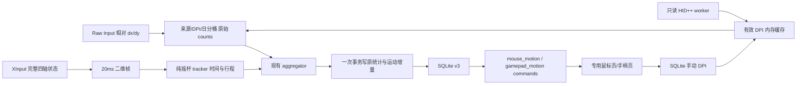

# 外设连续运动、鼠标 DPI 与统计页面实施方案

日期：2026-10-04。工程根目录：`C:\Users\17814\Documents\cl recoder`。源码路径均相对此根目录。执行终端为 pwsh；产品已有 Windows PowerShell 5.1 辅助脚本保持兼容。

实现基线为提交 `d86de51` 加执行开始时已有工作树。该基线已包含 correctness、heap 修复、今日范围、活动查询门控及上一轮验收补修。实现前记录实际 diff，保留这些成果，不按旧 Plan 恢复旧代码。

## 1. 整体设计理念

### 核心目标

| ID | 交付行为 |
|---|---|
| M1 | 每个可识别物理鼠标来源有独立 DPI 设置；读取到当前 DPI 时自动填入，否则允许手动填写并持久化 |
| M2 | 按对应鼠标、对应 DPI 时段估算物理移动距离；未配置部分保留原始移动量；鼠标选择不混入其他来源 |
| G1 | 左右摇杆分别统计位置停留时间热力图；持续推住继续累计时间，不依赖轴事件频率 |
| G2 | 左右摇杆分别统计归一化累计路径长度；持续推住不增路程，漂移、暂停、断连和休眠不产生虚假路程 |
| U1 | 重做鼠标页：鼠标图形、清楚的距离与 DPI 状态、分开的点击/滚动、折叠明细 |
| U2 | 重做手柄页：两张摇杆热力图为主视觉，精致手柄控件图为辅助，保留正确按钮统计 |
| D1 | 完成上一轮最终复测、候选构建、配套脚本同步与实际环境验收 |

连续输入与按钮计数使用独立数据通道和表。保持既有按键/组合/应用统计语义，不能把轴变化算成按钮次数。SQLite 增量迁移到版本 3；旧距离表保留为历史证据，不继续按固定 80 写入新距离。

鼠标按钮当前按型号分组；同型号两只鼠标可能 DPI 不同，因此**仅连续鼠标统计增加来源身份**，不改 `devices` 唯一键、不迁移旧按钮行。摇杆采样按连接隔离，持久结果仍归属既有手柄型号行；界面明确其型号汇总口径。

### 已确定的技术与范围

- 自动 DPI 首个实现只支持能唯一关联到当前物理鼠标的 **USB 直连 Logitech HID++ 2.0、0x2201、单传感器**。不探无线接收器槽位，不承诺蓝牙、0x2202 或所有品牌；这些来源正常使用手动 DPI。不能写一个永远 Unsupported 的空 provider 冒充自动读取完成。
- 手动 DPI 为单个正整数 `1..100000`，X/Y 同值。自动有效值优先，手动值作为自动不可用时的后备；自动恢复不删除后备值。
- 距离公式为 `Σhypot(dx,dy) / dpi × 0.0254`，界面称“移动距离（估算）”。按传感器计数计算，不取光标坐标，不使用显示器 DPI 或 Windows 指针速度。
- 摇杆行程单位固定为“R”，`1 R = 中心到满幅边缘`。中心→边缘→中心为 2 R，单位圆完整一周约 6.283 R；不是厘米。
- 本阶段做**历史停留热力图＋行程**，不增加高频 UI 流、实时尾迹、录像、轨迹回放或校准向导。原始逐点摇杆轨迹不持久化。
- 不新增第三方包。仅在 collector 的现有 windows 路径依赖启用所需系统 feature；复用 Rust 标准库、chrono、serde、rusqlite、gilrs、React Query、本地 SVG 和 Canvas。

### 设计原则

1. 自动探测只读硬件状态，不修改鼠标硬件 DPI、配对、档位、驱动或权限。
2. 不知道 DPI 就保留 counts，不编造米数；不把型号最大 DPI、默认 DPI 或过期读数当当前值。
3. 计数按采集时最近一次有效 DPI 读数分段。自动查询不是硬件切档通知，切档到下一次成功读取之间存在估算误差；之后填写或修改 DPI 不重算历史未配置数据。
4. 持续停留按时间积分；运动按同步二维坐标计算；不按事件次数和单轴到达顺序累加。
5. 数据和 UI 错误有明确状态；日志不记录运动流水、逐点坐标或 HID 原始响应。
6. UI 保留今日/fixed 范围与 native activity 门控；历史不轮询、隐藏不发周期查询；collector 独立采集。

## 2. 系统架构设计



### 模块职责和禁止耦合

| 模块 | 职责 | 边界 |
|---|---|---|
| core/motion | 采样时间、来源、DPI、二维点、运动事件/增量类型 | 不依赖 Win32、SQLite 或 React |
| engine/stick_motion | 纯采样状态机、时间拆日、热力分箱、路径过滤 | 不处理按钮，不查询配置，不探硬件 |
| collector/motion_runtime | 一个进程内时钟、来源注册、DPI worker/cache 生命周期 | 不提供第二条 GUI 管道 |
| collector/mouse_dpi | 定期读手动设置、调只读 provider、缓存状态/过期、发布元数据 | 不在窗口回调内进行 HID/SQL IO |
| collector/hidpp_dpi | 有限 HID++ 编解码和读取当前 DPI | 禁止 setSensorDpi、SDK 安装、型号猜值 |
| collector/hid_transport | SetupAPI/HID 枚举与唯一关联、限时 overlapped IO | 不以 VID 或产品名独自匹配另一个设备 |
| raw_input | 保留按钮/滚轮；按来源缓存 counts 并批发运动事件 | 不换算米，不把绝对输入当相对 counts |
| gamepad/xinput_motion | 原 gilrs 按钮逻辑保留；直接读取 XInput 的完整未过滤摇杆状态 | 不逐 AxisChanged 算行程，不修改 gilrs 默认按钮过滤 |
| aggregator/store | 接受运动事件、原子 flush、SQL 查询和手动配置写入 | GUI 只允许写新配置表，不能写统计表 |
| mouse/gamepad commands | 参数校验、DTO 映射、旧 schema 状态、配置入口 | 不手写 SQL，不探 HID、不通过中文错误猜类别 |
| UI | 选择来源/型号、展示与交互、门控查询 | 不用当前 DPI 在前端重算历史，不前端 SUM 原始运动样本 |

SQL 配置是一处权威来源。GUI 写新配置表；collector worker 每 500ms 一次批量读已连接来源配置。Raw Input 回调只读内存快照，绝不等待配置/探针。collector 的统计表仍只有现有 Writer 写入。

## 3. 文件级设计

下表为完整源码允许清单；执行者只能修改各自 Stage 所属文件。标“串行共享”的文件由依赖 Stage 接续编辑。文档交付为本文和评审记录。

| Stage | 文件 | 作用、关系和接口归属 |
|---|---|---|
| S0 | 不改源码 | 核实基线、上一轮补修、实际部署；输出简短差异清单 |
| S1 | 新`crates/core/src/motion.rs`、`crates/core/src/lib.rs` | §4.1完整共享类型先交付；AggEvent变体在S4/S5与消费者一起接入 |
| S1 | 新`crates/engine/src/stick_motion.rs`、`crates/engine/src/lib.rs` | §4.2纯 tracker，可独立测试 |
| S2 | `crates/store/src/schema.rs`、`crates/store/src/writer.rs`、`crates/store/src/lib.rs`、新`crates/store/src/motion.rs`、`crates/collector/src/engine_loop.rs`仅旧FlushBatch构造补Default | §6迁移、§4.4读写、FlushBatch新字段及编译兼容、原子回滚 |
| S3 | `crates/collector/Cargo.toml`、新`crates/collector/src/hidpp_dpi.rs`、新`crates/collector/src/hid_transport.rs` | §4.3协议和 Win32 feature；不改依赖版本/lock |
| S4 | 新`crates/collector/src/mouse_dpi.rs`、新`crates/collector/src/motion_runtime.rs`、`crates/collector/src/device.rs`、`crates/collector/src/raw_input.rs`、`crates/core/src/event.rs`、`crates/collector/src/ipc_server.rs`、`crates/collector/src/engine_loop.rs`、`crates/collector/src/main.rs`、`crates/collector/src/selftest.rs` | 完整鼠标链：§4.3缓存/来源、鼠标AggEvent及消费者、暂停代际、生产/自测接线；保留heap/IPC线格式；S3后串行 |
| S5 | 新`crates/collector/src/xinput_motion.rs`、`crates/collector/src/gamepad.rs`、`crates/core/src/event.rs`、`crates/collector/src/engine_loop.rs`、`crates/collector/src/main.rs`、`crates/collector/src/selftest.rs` | 增加手柄AggEvent及完整消费者、原始帧采样、tracker、最终收尾屏障；依赖 S4；不改 apps/app_time |
| S3/S4/S5 | `crates/collector/src/main.rs` | S3仅声明HID两个mod；S4接完整鼠标；S5接手柄/收尾；依赖严格串行 |
| S6 | 新`src-tauri/src/commands/mouse_motion.rs`、新`src-tauri/src/commands/gamepad_motion.rs`、`src-tauri/src/commands/mod.rs` | §4.5 DTO/命令注册；配置的有限 rw 入口复用 db::open_rw |
| S6 | `ui/src/api/types.ts`、`ui/src/api/client.ts`、`ui/src/api/mock.ts`、`ui/src/api/queries.ts` | §4.5前端类型/调用/mock/hooks；依赖已有 policy/activity |
| S7 | 新`ui/src/lib/motionPresentation.ts`、新`ui/src/components/StickHeatmap.tsx`、新`ui/src/components/PeripheralControlsStats.tsx`、新`ui/src/components/MouseDpiEditor.tsx`、新`ui/src/components/MouseSourcePicker.tsx`、新`ui/src/components/MotionSummary.tsx`、`ui/src/theme.css` | §4.6独立展示组件；本地 SVG/Canvas/原生表单，组件不查询 API |
| S7 | 新`ui/tests/motion-presentation.test.mjs`、`ui/package.json` | 热力/几何/单位/校验测试；只改 scripts，无 UI lock 改动 |
| S8 | `ui/src/pages/Mouse.tsx`、`ui/src/pages/Gamepad.tsx`、`ui/src/components/DeviceStatsPage.tsx` | 专用页面组装；共享页只供键盘，移除旧80换算展示支路，保留键盘合同 |
| S9 | `src-tauri/src/commands/export.rs` | §6.3导出追加新数据，版本/行数/CSV回归；不改 WP 导入 |
| S10 | 新`ui/tests/motion-pages.test.mjs`、`ui/package.json` | 页面/查询/mock/保存/重试契约验收；package在 S7后串行 |
| S11 | 不改额外源码 | 合并验收、暂存 release、脚本同步、部署与真实设备验证 |

原 `deviceLayouts.ts`/`DeviceLayoutStats.tsx`保留供键盘及既有测试，Mouse/Gamepad不再使用其矩形模板。不改 App 路由、Sidebar、Settings、WP页、UI lock、原控制 IPC 协议。

允许唯一依赖配置变更：collector 的 windows workspace依赖增加 `Win32_Devices_HumanInterfaceDevice`、`Win32_Devices_DeviceAndDriverInstallation`、`Win32_Devices_Properties`、`Win32_UI_Input_XboxController`；现有 IO/Threading feature 复用。不新增包，不在其他 crate 启用不使用的 feature。

## 4. 接口与数据结构设计

### 4.1 共享事件（core/motion.rs、event.rs）

下面是设计声明；类型完整给出，不包含方法体。Rust snake_case 序列化只用于内部/自测；GUI camelCase 合同见 §4.5。

```rust
#[derive(Debug, Clone, Copy, PartialEq, Eq, Hash, Serialize, Deserialize)]
pub struct MotionConnectionId(pub u64);
#[derive(Debug, Clone, Copy, PartialEq, Serialize, Deserialize)]
pub struct MotionStamp { pub mono_us:u64, pub unix_us:i64 }
#[derive(Debug, Clone, Copy, Default, PartialEq, Eq, Serialize, Deserialize)]
pub struct MotionControlSnapshot { pub epoch:u64, pub paused:bool }
#[derive(Debug, Clone, Copy, PartialEq, Serialize, Deserialize)]
pub struct StickPoint { pub x:f64, pub y:f64 }
#[derive(Debug, Clone, Copy, PartialEq, Eq, Hash, Serialize, Deserialize)]
#[serde(rename_all="snake_case")]
pub enum StickSide { Left, Right }
#[derive(Debug, Clone, Copy, PartialEq, Eq, Hash, Serialize, Deserialize)]
#[serde(rename_all="snake_case")]
pub enum DpiOrigin { Auto, Manual, Unknown }
#[derive(Debug, Clone, Copy, PartialEq, Eq, Hash, Serialize, Deserialize)]
pub struct EffectiveDpi { pub value:Option<u32>, pub origin:DpiOrigin }
#[derive(Debug, Clone, PartialEq, Serialize, Deserialize)]
pub struct MouseSourceDescriptor {
  pub source_key:String, pub model:DeviceKey,
  pub interface_path:Option<String>, pub physical:bool,
}
#[derive(Debug, Clone, Copy, PartialEq, Eq, Serialize, Deserialize)]
#[serde(rename_all="snake_case")]
pub enum DpiProbeStatus { Pending, Available, Unsupported, Ambiguous, Unavailable, Disconnected }
#[derive(Debug, Clone, PartialEq, Serialize, Deserialize)]
pub struct MouseSourceState {
  pub descriptor:MouseSourceDescriptor, pub connection:MotionConnectionId,
  pub connected:bool, pub stamp:MotionStamp,
  pub probe_status:DpiProbeStatus, pub auto_dpi:Option<u32>,
  pub auto_valid_until_unix_us:Option<i64>,
}
#[derive(Debug, Clone, PartialEq, Serialize, Deserialize)]
pub struct MouseTravelDelta {
  pub descriptor:MouseSourceDescriptor, pub connection:MotionConnectionId,
  pub day:String, pub counts:f64, pub dpi:EffectiveDpi, pub control:MotionControlSnapshot,
}
#[derive(Debug, Clone, PartialEq, Serialize, Deserialize)]
pub struct GamepadMotionFrame {
  pub device:DeviceKey, pub connection:MotionConnectionId, pub stamp:MotionStamp,
  pub left:StickPoint, pub right:StickPoint, pub control:MotionControlSnapshot,
}
#[derive(Debug, Clone, PartialEq, Serialize, Deserialize)]
pub struct StickBinDelta { pub bin:u16, pub dwell_us:u64 }
#[derive(Debug, Clone, PartialEq, Serialize, Deserialize)]
pub struct StickDayDelta {
  pub day:String, pub side:StickSide, pub active_us:u64,
  pub travel_r:f64, pub bins:Vec<StickBinDelta>,
}
```

AggEvent在S4新增`MouseSourceState(MouseSourceState)`、`MouseTravel(MouseTravelDelta)`，同时更新所有穷尽match与鼠标增量消费；S5再增加`GamepadMotion(GamepadMotionFrame)`、`GamepadMotionDisconnected{connection:MotionConnectionId}`，同时接手柄消费。生命周期/运动不是按钮事件，不增加 `events_seen`/按钮总量，不计入应用键鼠次数。旧 `RawEvent::MouseMove{distance_inches}`保留给旧合成 fixture，真实 Raw Input 停止发送它；不得把新 counts 塞入旧 distance_inches 字段。

`source_key`：真实鼠标接口路径按 Windows 大小写不敏感语义规范化为小写完整路径；来自现有 heap-safe 原生读取，保留原路径供 HID 定位。连接ID进程内单调分配，断连重连生成新值；来源key和连接ID不能互换。路径不可读/hDevice=0归入 `virtual:unknown`，physical=false，保留 raw counts，禁自动/手动物理 DPI；不猜物理设备。

时间：MotionRuntime持有启动 Instant，并在采样时同时取得单调 elapsed microseconds 和 UTC unix microseconds。两采集线程用同一时钟。绝不以 aggregator 到达时间代替捕获时间。

暂停：Flags内部新增Mutex保护的MotionControlSnapshot，`Flags::set_paused(bool)`在锁内仅当状态改变时递增epoch，同时更新旧paused AtomicBool；IPC SetPaused调用该方法，线格式不变。`Flags::motion_control()->MotionControlSnapshot`返回一致快照，producer和aggregator都使用；不能把AtomicBool＋epoch分开读取。真实暂停即使在两个采样之间发生又恢复，epoch仍变化，tracker必须reset。旧app计时继续使用已有paused观察逻辑，本轮不重写它。

### 4.2 摇杆 tracker（engine/stick_motion.rs）

```rust
pub const STICK_GRID_SIZE:usize = 25;
pub struct StickMotionTracker { /*连接内纯状态*/ }
pub fn StickMotionTracker::new()->Self;
pub fn StickMotionTracker::feed(&mut self, stamp:MotionStamp,
  side:StickSide, point:StickPoint)->Vec<StickDayDelta>;
pub fn StickMotionTracker::reset(&mut self);
pub fn stick_bin(point:StickPoint)->u16;
```

每个连接×side独立 tracker。输入 x向右、y向上，范围[-1,1]；若半径>1做径向投影到单位圆，不逐轴硬压对角。NaN/Inf拒绝且reset；首帧仅建立锚点，不把“接入时已推住”算成中心出发。普通采样间隔约20ms，使用实际捕获 dt。

非显然算法合同：

- 活动迟滞：从静止状态半径≥0.20进入活动，活动半径≤0.15退出；非活动点用于行程的有效位置为(0,0)。活动态用规范化实际点，不另做按键计数。
- 路径去噪：与最近**接受的行程锚点**距离≥0.01 R才接受新的锚点并加欧氏距离；不与上一原始噪声点累积。退出死区返回(0,0)时结算一次返回段。固定点重复一万帧不会增加行程。
- 时间积分采用前一完整帧的位置/活动态，对 `[prev,current)` 累计实际 dt；保持同一点无 AxisChanged 时仍累计。归档微秒，无每帧整数秒截断。
- 单调 dt≤0、dt>250ms、UTC差与单调差相差>250ms：不填补该间隔、reset并将当前点设为新锚点。休眠/时钟跳变/断线不能画长线或填一夜热度。
- UTC不递增时reset；正常跨本地午夜以UTC两端确定午夜切点的比例，按该比例分配单调dt，最后一段取剩余微秒保证总和；路程增量归当前采样日。chrono本地日历转换，不能固定加24小时。UTC差120ms、mono差20ms且午夜居中时各归10ms，不归120ms。
- 分箱：column=floor((x+1)/2×25)、row=floor((1-y)/2×25)，边界clamp到0..24，bin=row×25+column，0在左上，y正向上。只归档活动时间，neutral不占热力总量。
- 每日 `active_us = Σbins.dwell_us`。允许微秒级尾差修正到原位置格，不能用图形平滑后的值作统计。

示例：完整帧 t=0 中心；t=20ms满幅右；之后每20ms持续采样同一点直到t=1020ms；t=1040ms中心：路程2 R，右侧累计活动1020ms，neutral时间不入热力。从已有满幅点首次建立锚点、每20ms采样保持1秒：0 R、1秒活动。仅给两帧且相隔1秒则不补停留时间。

### 4.3 鼠标来源、DPI 和采集（collector）

```rust
pub struct MotionRuntime { /*clock、dpi cache、flags、worker*/ }
// ipc_server.rs内部结构，CtlRequest/CtlResponse不增加字段。
pub struct Flags {
  pub paused:AtomicBool, pub shutdown:AtomicBool,
  pub producer_stop:AtomicBool, pub producers_drained:AtomicBool,
  motion_control_state:Mutex<MotionControlSnapshot>,
}
pub fn Flags::set_paused(&self,paused:bool);
pub fn Flags::motion_control(&self)->MotionControlSnapshot;
pub fn MotionRuntime::start(writer:Arc<Writer>,flags:Arc<Flags>,tx:Sender<AggEvent>)->Arc<Self>;
pub fn MotionRuntime::offline(flags:Arc<Flags>)->Arc<Self>; // selftest：无DB/HID worker
pub fn MotionRuntime::stamp(&self)->MotionStamp;
pub fn MotionRuntime::allocate_connection(&self)->MotionConnectionId;
pub fn MotionRuntime::observe_mouse(&self,descriptor:MouseSourceDescriptor,
  connection:MotionConnectionId,connected:bool);
pub fn MotionRuntime::dpi_for(&self,key:&str)->EffectiveDpi;
pub fn MotionRuntime::control(&self)->MotionControlSnapshot;
pub fn MotionRuntime::stop_requested(&self)->bool;
pub fn MotionRuntime::stop_worker(&self); // 停协调生产者，不等待不可取消的原生IO
pub struct RawInputRunner { /*线程及本线程消息唤醒信息*/ }
pub fn RawInputRunner::stop_and_join(self)->std::thread::Result<()>;
pub fn raw_input::spawn(tx:Sender<AggEvent>,motion:Arc<MotionRuntime>)->RawInputRunner;
pub fn gamepad::spawn(tx:Sender<AggEvent>,motion:Arc<MotionRuntime>)->JoinHandle<()>;
pub fn device::DeviceResolver::mouse_source(&mut self,handle:HANDLE)->MouseSourceDescriptor;
pub enum DpiProbeResult { Available(u32), Unsupported, Ambiguous, Unavailable }
pub fn hidpp_dpi::probe_current_dpi(descriptor:&MouseSourceDescriptor,
  timeout:Duration)->DpiProbeResult;
pub struct HidppRequest { pub feature:u8, pub function:u8, pub sw_id:u8, pub params:Vec<u8> }
pub fn hidpp_dpi::encode_request(request:&HidppRequest)->Result<[u8;20],String>;
pub fn hidpp_dpi::decode_response(request:&HidppRequest,bytes:&[u8])->Result<Option<Vec<u8>>,String>;
pub struct HidEndpoint { /*私有句柄/关联信息*/ }
pub enum HidEndpointMatch { Unsupported, Ambiguous, Unique(HidEndpoint) }
pub fn hid_transport::find_direct_endpoint(descriptor:&MouseSourceDescriptor)->Result<HidEndpointMatch,String>;
pub fn hid_transport::exchange(endpoint:&mut HidEndpoint,request:&[u8;20],
  deadline:Instant)->Result<Vec<u8>,String>;
pub struct XInputMotionSampler { /*slot0..3连接代际*/ }
pub fn XInputMotionSampler::new()->Self;
pub fn XInputMotionSampler::sample(&mut self,stamp:MotionStamp,
  control:MotionControlSnapshot,motion:&MotionRuntime)->Vec<AggEvent>;
```

类型归属固定：Flags在ipc_server.rs，MotionRuntime在motion_runtime.rs，RawInputRunner在raw_input.rs，DpiProbeResult/HidppRequest在hidpp_dpi.rs，HidEndpoint/HidEndpointMatch在hid_transport.rs，XInputMotionSampler在xinput_motion.rs。S3不依赖S4尚未交付的mouse_dpi；worker从已交付hidpp_dpi导入result类型。Unsupported/Ambiguous由enum判定，transport Err映射Unavailable，不解析中文字符串。

#### 自动读取的实际实现

关联：Raw接口经SetupAPI定位devnode，读取非空DEVPKEY_Device_ContainerId并沿父devnode确认USB祖先；vendor HID collection同ContainerID、VID=046D且唯一。ContainerID/0xFF本身不能排除接收器，随后还须通过0x0005 GetDeviceType只读查询证明是Mouse(type=3)，Receiver(type=7)、缺feature或无法确认均Unsupported；不试其他device index。不能仅按型号/VID抓到旁边另一只鼠标。HidD_GetPreparsedData/HidP_GetCaps校验vendor collection，**本轮仅接受InputReportByteLength与OutputReportByteLength都恰为20、声明0x11输入/输出报告**；不满足走手动。通用鼠标输入collection不作为可写端点。

HID++只查询：device index固定0xFF，software id固定0x0B；long report `0x11`，总20字节。Root ping确认major≥2及nonce；Root getFeature查0x0005并调用function2确认Mouse，再查0x2201（index=0为Unsupported）；getSensorCount必须为1；getSensorDpi(sensorIdx=0)取当前值，不能取defaultDpi。值1..57343才Available。依据：[Logitech当前协议资料](https://github.com/Logitech/cpg-docs/blob/master/hidpp20/README.rst)、[0x2201查询规范](https://lekensteyn.nl/files/logitech/x2201_adjustabledpi.html)。不复制第三方驱动，不发设置命令。

编码第0字节report、第1字节0xFF、第2字节feature、第3字节(function<<4)|sw_id，params从4开始、余下补0。Root ping function1参数[0,0,nonce]；getFeature function0参数为featureID大端两字节＋0（0x0005和0x2201分别查询）；GetDeviceType function2无参数；传感器数量function0；当前DPI function2参数[0]。解码接受0x10的7字节有效帧（可能由20字节Windows缓冲承载）和0x11的20字节帧，按report ID校验最小字节数；匹配device/feature/function/sw_id，ping另校验nonce；其他响应/通知返回None，协议error返回Err。传感器payload[0]=0、payload[1..3]大端当前值，例如[0,0x03,0x20,0x01,0x90]当前800、默认400，只能返回800。

原生IO：共享读写、overlapped WriteFile/ReadFile；按CAPS分配20字节buffer，再按实际report ID和返回字节数解码。1500ms是业务结果接受期限和停止发后续查询的期限，**不是驱动一定收尾的硬保证**。协调worker到期立即发布Unavailable，slot发CancelIoEx；在完成前持续持有buffer/OVERLAPPED/句柄，不释放或复用，不接受迟到结果，不开启第二个probe slot。取消迟迟未完成只停自动读取，手动配置/输入照常。[微软取消规则](https://learn.microsoft.com/en-us/windows/win32/api/ioapiset/nf-ioapiset-cancelioex)。

每2秒检查支持的已连接来源，4秒自动数值过期；Unsupported/Ambiguous同连接不重探，Unavailable每10秒重试，重连重判。每500ms配置批读独立于唯一硬件执行槽；结果带连接代际。shutdown停止协调worker及后续事件发布，不无限等待挂起probe；其仍由存活执行槽持有到IO完成或进程正常退出，不能提前释放资源。该slot不持有Writer锁、不阻挡aggregator最终flush。

自动米数按“最近有效读取值”估算；硬件切档可能延迟一个查询周期才建立新桶，若发生超时则延迟到下一次成功读取。UI保持“估算”标签，测试只保证新读数发布后使用新值，不声称识别切档发生时刻。

成功/错误状态在 `MouseSourceState` 发布，成功缓存延长有效期也发布，以便DB上的自动值过期判断；约每2秒一次，不逐输入写日志。manual配置查询失败只保留上一份已确认manual值并告警；首次未加载为unknown，不猜80。auto有效优先，其次manual，否则value=None/origin=Unknown。

#### 相对移动 counts

- 在注册 Raw Input 后枚举当前鼠标，首次输入也懒注册；无需移动才能出现DPI入口。接口路径/ContainerID只在注册或重连查询，沿用heap-safe读取和缓存。
- 每个相对 RAWMOUSE 包只计算一次 `hypot(dx,dy)`。绝对输入不混成counts；保留按钮/滚轮已有行为。physical=false仅保留未知来源原始量，不开放物理DPI换算。
- 原始移动桶按连接×捕获本地日×EffectiveDpi分隔。DPI快照/日期/暂停态变化先发旧桶再开始新桶；每25ms WM_TIMER批发有内容的桶，disconnect/正常退出排出尾数。无需累计到假英寸门槛，低DPI短距离不能长期藏在0.25英寸零头里。
- Raw包携带一致control快照：paused包不累计，epoch变化先发旧有效桶再换新桶；无论到达时当前是否paused，已捕获为非暂停的独立counts增量可落库，不跨epoch混桶。短暂停再恢复也触发epoch换桶。包内发生的硬件运动不可细分暂停时刻，口径以包捕获快照为准。数据库故障仍由aggregator保留增量，不重放原包。
- 真实生产分支停止写旧 `mouse_move_daily`。selftest保留旧样例指纹，同时增加新运动合成场景；fixture runtime禁真实HID/生产DB。

#### 手柄帧

维持原gilrs8ms循环和数字/扳机逻辑。新xinput_motion每≥20ms直接调用XInputGetState采样slot0..3，不读取gilrs已deadzone过滤的轴缓存、不改变其filter。一次XINPUT_STATE已包含四轴，同一帧读取；正i16轴除32767、负值除32768，Y正向上，然后由tracker径向规范化与本文迟滞处理。无变化也采样；四轴非分离AxisChanged路径。设备key固定复用本backend的`device_key("Xbox Controller")`，与既有型号行一致；motion连接代际按原生slot独立分配，不假定GamepadId等于slot。首次成功建锚点，ERROR_DEVICE_NOT_CONNECTED断连清锚点，其他读取失败跳帧并reset，轮询上下文重建也换代际。不得在断连时合成回中立路程。[XINPUT_GAMEPAD轴定义](https://learn.microsoft.com/en-us/windows/win32/api/xinput/ns-xinput-xinput_gamepad)

### 4.3.1 正常退出与暂停接线

Flags追加内部`producer_stop:AtomicBool`与`producers_drained:AtomicBool`，初始false，不进IPC线格式。IPC shutdown只设置既有shutdown请求。main发现请求后置producer_stop，调用RawInputRunner.stop_and_join（向自有消息线程发stop、窗口线程排出已捕获的尾桶并退出），join会检查stop的gamepad生产者，再停DPI协调worker；全部生产者停止后发布producers_drained，最后join aggregator。aggregator看到shutdown但未drained时继续接收已捕获增量，drained后排空并最后flush；不得提前finish。

Raw注册失败/重试、gamepad init重试均须检查producer_stop；停止唤醒只发本进程自有消息线程，不改系统输入。异常join写诊断并进入已终止生产者的收尾，不能因运动线程已panic永远等待。DPI挂起IO不是继续发布事件的生产者，不阻塞drained；不可取消IO的资源按上文安全生命周期处理。

aggregator每次运动帧前读Flags.motion_control：当前epoch变化reset全部摇杆tracker；捕获epoch与当前不一致或任一paused时reset/跳过，不跨短暂停连接坐标。鼠标各包counts按捕获control判断，与连续摇杆帧的跨间隔积分不同。selftest里模拟暂停改用set_paused，不直接修改motion快照。

### 4.4 Store合同与增量（store/motion.rs、writer.rs）

```rust
pub struct MouseMotionWrite {
  pub source_id:i64, pub day:String, pub dpi:u32, // unknown编码0
  pub origin:DpiOrigin, pub counts:f64,
}
pub struct StickMotionWrite {
  pub device_id:i64, pub day:String, pub side:StickSide,
  pub active_us:u64, pub travel_r:f64, pub bins:Vec<StickBinDelta>,
}
// FlushBatch保留旧4字段，追加以下两个字段；显式构造者补Default，其余不改单位。
// pub mouse_motion:Vec<MouseMotionWrite>, pub stick_motion:Vec<StickMotionWrite>
pub struct MouseConfigRow { pub source_key:String, pub manual_dpi:Option<u32> }
pub fn register_mouse_source(conn:&Connection,descriptor:&MouseSourceDescriptor,
  device_id:i64,observed_at:&str)->Result<i64>;
pub fn update_mouse_source_state(conn:&Connection,id:i64,state:&MouseSourceState)->Result<()>;
pub fn read_manual_dpi(conn:&Connection,keys:&[String])->Result<Vec<MouseConfigRow>>;
pub fn set_manual_dpi(conn:&Connection,source_id:i64,dpi:Option<u32>)->Result<()>;
pub fn list_mouse_sources(conn:&Connection,now_unix_us:i64)->Result<Vec<MouseSourceRow>>;
pub fn mouse_motion(conn:&Connection,source_id:i64,from:&str,to:&str)->Result<MouseMotionSummary>;
pub fn legacy_mouse_counts(conn:&Connection,device_id:i64,from:&str,to:&str)->Result<f64>;
pub fn mouse_legacy(conn:&Connection,device_id:i64,from:&str,to:&str)->Result<LegacyMouseSummary>;
pub fn gamepad_motion(conn:&Connection,device_id:i64,from:&str,to:&str)->Result<GamepadMotionSummary>;
pub fn motion_schema_ready(conn:&Connection)->Result<bool>;
pub fn export_motion_rows(conn:&Connection,from:&str,to:&str)->Result<MotionExportRows>;
pub fn Writer::register_mouse_source(&self,descriptor:&MouseSourceDescriptor)->Result<i64>;
pub fn Writer::update_mouse_source_state(&self,id:i64,state:&MouseSourceState)->Result<()>;
pub fn Writer::manual_dpi(&self,keys:&[String])->Result<Vec<MouseConfigRow>>;
```

Store对外行类型固定如下，内存类型不靠SQL字段猜测。GUI显式转camelCase DTO，不直接Serialize整个内部row：

```rust
pub enum MotionAvailability { Ready, NeedsUpgrade }
pub struct MouseSourceRow {
  pub id:i64, pub device_id:i64, pub name:String, pub nickname:Option<String>,
  pub physical:bool, pub connected:bool, pub manual_dpi:Option<u32>,
  pub auto_dpi:Option<u32>, pub auto_valid_until:Option<String>,
  pub effective_dpi:Option<u32>, pub dpi_origin:DpiOrigin, pub probe_status:DpiProbeStatus,
}
pub struct MouseMotionDay {
  pub day:String, pub raw_counts:f64, pub meters:Option<f64>, pub unconfigured_counts:f64,
}
pub struct MouseMotionSummary {
  pub availability:MotionAvailability, pub source_id:i64,
  pub raw_counts:f64, pub meters:Option<f64>, pub unconfigured_counts:f64,
  pub coverage:Option<f64>, pub days:Vec<MouseMotionDay>,
}
pub struct LegacyMouseSummary { pub device_id:i64, pub raw_counts:f64 }
pub struct StickMotionSummary {
  pub side:StickSide, pub active_seconds:f64, pub travel_r:f64,
  pub dwell_seconds:Vec<f64>,
}
pub struct GamepadMotionSummary {
  pub availability:MotionAvailability, pub device_id:i64, pub grid_size:u8,
  pub left:StickMotionSummary, pub right:StickMotionSummary,
}
pub struct ExportMouseSourceRow {
  pub source_id:i64, pub device_id:i64, pub name:String, pub manual_dpi:Option<u32>,
}
pub struct ExportMouseMotionRow {
  pub source_id:i64, pub day:String, pub dpi:Option<u32>, pub dpi_origin:DpiOrigin,
  pub counts:f64, pub meters:Option<f64>,
}
pub struct ExportGamepadMotionRow {
  pub device_id:i64, pub day:String, pub stick:StickSide, pub active_us:u64, pub travel_r:f64,
}
pub struct ExportGamepadHeatRow {
  pub device_id:i64, pub day:String, pub stick:StickSide, pub bin:u16, pub dwell_us:u64,
}
pub struct ExportLegacyMouseRow { pub device_id:i64, pub day:String, pub raw_counts:f64 }
pub struct MotionExportRows {
  pub mice:Vec<ExportMouseSourceRow>, pub mouse_daily:Vec<ExportMouseMotionRow>,
  pub gamepad_daily:Vec<ExportGamepadMotionRow>, pub gamepad_heat:Vec<ExportGamepadHeatRow>,
  pub legacy_mouse_daily:Vec<ExportLegacyMouseRow>,
}
```

derive Debug/Clone等常规实现由executor决定，字段类型与名称不改。GUI/导出为legacy行添加常量quality="legacy_uncalibrated"；内部source_key不在这些对外行中。新MotionAvailability在store::motion定义，GUI映射ready/needs_upgrade；enum序列化可由DTO adapter处理。来源注册缓存以source_key为键；model id复用Writer缓存。来源状态应用时检查同来源当前连接代际，旧代disconnect不得把新连接标离线；进程重启首次注册重置代际，不与上个进程数字比较。

新两类运动增量与旧input/apps/combo在**同一个Writer.flush事务**：任何部分失败全回滚，aggregator将所有桶合回，成功后才丢桶；不能在flush外单独提交heat bins或distance。Writer与aggregator现有“空批次提前返回”判定都必须纳入mouse_motion/stick_motion，只有保持帧产生的热度也必须落库。来源元数据/手动配置不是增量，幂等写入失败可重试，不增加counts。

来源/型号注册失败时，已获得的运动增量按source_key或DeviceKey×日×DPI/side压缩保留，注册成功后绑定数据库ID再flush；不丢新counts、不重新喂旧坐标来回放路程。与现有flush桶共用失败/重试生命周期，不新增逐点队列。metadata只保留最新连接代际状态；原按钮注册失败的既有行为不顺手重构。

SQL算 meters=`Σ(counts/dpi*0.0254)`仅dpi>0；rawCounts所有新桶求和；unconfiguredCounts仅dpi=0；`coverage`按已配置counts/totalCounts，total=0时null。不能把未配置counts当0米后展示“全部距离”。legacyCounts单独来自旧表×80，只说明旧算法原始量，可放型号历史说明，不能归给任一物理来源或套当前dpi变成米。

示例：同来源800DPI桶800counts＋1600DPI桶1600counts＋unknown桶400counts→rawCounts2800、meters0.0508、unconfiguredCounts400、coverage约0.857143。修改manual=3200后以上结果保持原样，新桶才用3200。两只同型号分别1600counts/800DPI与1600counts/1600DPI→0.0508m与0.0254m，不串设置。

### 4.5 GUI与前端线合同

所有新增查询返回Result，不使用swallow把SQL失败伪装成没有运动；无schema返回availability=needs_upgrade，合法空数据availability=ready。原命令容错策略不全局更改。

```typescript
type Range = {from:string;to:string}; // 合法YYYY-MM-DD闭区间
type MotionAvailability = "ready"|"needs_upgrade";
type DpiOrigin = "auto"|"manual"|"unknown";
type DpiProbeStatus = "pending"|"available"|"unsupported"|"ambiguous"|"unavailable"|"disconnected";
interface MouseSourceRow {
  id:number; deviceId:number; name:string; nickname:string|null;
  physical:boolean; connected:boolean;
  manualDpi:number|null; autoDpi:number|null; autoValidUntil:string|null;
  effectiveDpi:number|null; dpiOrigin:DpiOrigin; probeStatus:DpiProbeStatus;
}
interface MouseSources { availability:MotionAvailability; sources:MouseSourceRow[] }
interface MouseMotionDay {
  day:string; rawCounts:number; meters:number|null; unconfiguredCounts:number;
}
interface MouseMotionSummary {
  availability:MotionAvailability; sourceId:number;
  rawCounts:number; meters:number|null; unconfiguredCounts:number;
  coverage:number|null; days:MouseMotionDay[];
}
interface LegacyMouseSummary {
  deviceId:number; rawCounts:number; quality:"legacy_uncalibrated";
}
interface StickMotionSummary {
  side:"left"|"right"; activeSeconds:number; travelR:number;
  dwellSeconds:number[]; // 恰625，row-major；无数据全0
}
interface GamepadMotionSummary {
  availability:MotionAvailability; deviceId:number; gridSize:25;
  left:StickMotionSummary; right:StickMotionSummary;
}
function getMouseSources():Promise<MouseSources>;
function getMouseMotion(sourceId:number,from:string,to:string):Promise<MouseMotionSummary>;
function getMouseLegacy(deviceId:number,from:string,to:string):Promise<LegacyMouseSummary>;
function setMouseDpi(sourceId:number,dpi:number|null):Promise<MouseSourceRow>;
function getGamepadMotion(deviceId:number,from:string,to:string):Promise<GamepadMotionSummary>;
function useMouseSources():UseQueryResult<MouseSources,Error>;
function useMouseMotion(sourceId:number|null,range:Range):UseQueryResult<MouseMotionSummary,Error>;
function useGamepadMotion(deviceId:number|null,range:Range):UseQueryResult<GamepadMotionSummary,Error>;
```

Rust command完整签名：

```rust
pub async fn get_mouse_sources(state:tauri::State<'_,AppState>)->Result<MouseSourcesDto,String>;
pub async fn get_mouse_motion(state:tauri::State<'_,AppState>,source_id:i64,
  from:String,to:String)->Result<MouseMotionSummaryDto,String>;
pub async fn get_mouse_legacy(state:tauri::State<'_,AppState>,device_id:i64,
  from:String,to:String)->Result<LegacyMouseSummaryDto,String>;
pub async fn set_mouse_dpi(source_id:i64,dpi:Option<u32>)->Result<MouseSourceRowDto,String>;
pub async fn get_gamepad_motion(state:tauri::State<'_,AppState>,device_id:i64,
  from:String,to:String)->Result<GamepadMotionSummaryDto,String>;
```

DTO逐字段对应TS，`#[serde(rename_all="camelCase")]`；Tauri参数sourceId/deviceId。正ID、日期、DPI范围、来源physical及归属kind在后端校验；rawpath/ContainerID不暴露前端。set命令经spawn_blocking和db::open_rw调用store新配置函数，不用Writer::open迁移，也不改Settings JSON。auto有效时拒绝改manual，前端自动值只读；Unavailable后可编辑原manual；null清除后备。配置写成功才刷新query，失败保留编辑内容并展示错误。

meters：有已配置新移动时为该部分距离（可为0）；没有任何已配置移动时null，UI显示“未配置/暂无可换算数据”，不用0米冒充。纯空范围raw=0、meters=null、coverage=null；未知sourceId返回错误，不静默切全部鼠标。sources.connected基于collector发布状态且观测时间≤5秒，否则false；有效auto要求connected且未过期，否则autoDpi/effective自动值=null。手动值可离线显示，仅用于之后采集。

Mock实现同签名、合法日/625格，明确模拟数据，不发真实HID/UAC；包含同型号两来源、不同DPI、自动值/失败/manual、partial coverage、旧schema、无数据。sourceId是独立物理来源，deviceId只供型号按钮查询。键盘/Apps/WP原mock不顺手重写。

旧schema或sources为空时，Mouse页仍经useDevices取得已有mouse型号，选择model id后照常getTopKeys/getKeyDaily与getMouseLegacy，不伪造source。新版有sources时，按钮仍用所选source.deviceId，legacy用独立getMouseLegacy；后者支持schema2、按deviceId查询，schema1没有旧距离表则合法0，SQL真实错误必须返回失败。没有物理来源不应让旧按钮/历史从界面消失。

Query：sources活动时2秒；mouse/gamepad motion和其按钮TopKeys活动且range含今日时1秒，历史无interval；全部复用uiQueryPolicy，enabled取AND，meta.uiOwned。跨source/device/range不keepPreviousData。配置保存使mouseSources失效；历史motion不重算，当前新计数由既有周期刷新。运动days随summary返回，展开表复用它、不额外查询；只有旧按钮getKeyDaily和legacy查询按各自明细展开门控、legacy无interval。未知schema在组件旁提供“启动/更新采集器后可用”，不要阻挡原按钮页。

### 4.6 展示组件自包含合同

```typescript
interface TopKeyRow {code:number;total:number;label:string}
interface HeatCell {bin:number;seconds:number;x:number;y:number;intensity:number}
function heatCells(dwellSeconds:readonly number[],scaleMaxSeconds:number):HeatCell[];
function formatTravelR(value:number):string;
function formatMouseDistance(meters:number|null):string;
function parseManualDpi(text:string):{ok:true;dpi:number}|{ok:false;message:string};
interface StickHeatmapProps {
  title:string; summary:StickMotionSummary; selectedBin:number|null;
  scaleMaxSeconds:number;
  onSelect:(bin:number|null)=>void; loading?:boolean;
}
function StickHeatmap(props:StickHeatmapProps):React.ReactElement;
interface PeripheralControlsStatsProps {
  kind:"mouse"|"gamepad"; rows:TopKeyRow[];
  selectedCode:number|null; onSelect:(code:number|null)=>void; loading?:boolean;
}
function PeripheralControlsStats(props:PeripheralControlsStatsProps):React.ReactElement;
interface MouseDpiEditorProps {
  source:MouseSourceRow; pending:boolean;
  onSave:(dpi:number|null)=>Promise<void>;
}
function MouseDpiEditor(props:MouseDpiEditorProps):React.ReactElement;
interface MouseSourcePickerProps {
  sources:MouseSourceRow[]; models:MouseModelRow[]; selection:MouseSelection|null;
  onSelect:(selection:MouseSelection)=>void;
}
interface MouseModelRow {id:number;name:string;nickname:string|null}
type MouseSelection = {kind:"source";id:number}|{kind:"model";id:number};
function MouseSourcePicker(props:MouseSourcePickerProps):React.ReactElement;
interface MotionSummaryProps {
  items:readonly {id:string;label:string;value:string;hint?:string}[];
}
function MotionSummary(props:MotionSummaryProps):React.ReactElement;
```

`heatCells`输入625个秒数和页面两侧共同最大值，输出625个单元；x/y为格中心，intensity=`sqrt(seconds/scaleMaxSeconds)`，scale=0全0。仅图形归一化，秒数保持原值；缺625值属于上游合同错误，测试捕获，不补造真实数据。formatTravelR用千分位＋最多2小数＋“ R”；鼠标<1m显示cm、≥1m显示m、≥1000m显示km，保留足够有效位（最多3有效小数），null显示“—”。DPI仅十进制整数，无小数/科学计数法，1..100000。

热力：本地Canvas、CSS主题青绿→明亮青绿的单色强度；25×25停留量，固定空间核仅渲染平滑，不修改数值。页面取左右625格共1250值中的max作为scaleMaxSeconds传两图，不每侧独自缩放。圆盘y向上，灰色中心死区、方向直接标签，选中位置显示精确停留时间及占活动时间比例。tooltip不是唯一读数入口；每图提供原生range选格及选中值供键盘读屏，不能有625个Tab入口。selectedBin在范围/型号变化清空。

鼠标控件图：饱满鼠标轮廓，左右大面板、中键/滚轮轴、X1/X2沿侧边；四个滚动方向用箭头控件，不能把按下和滚动合计。手柄：真实双握把比例，圆形ABXY（Y上/X左/B右/A下）、十字形D-pad、圆形LS/RS、顶部扳机和横向肩键、View/Menu/Guide居中。计数放在按钮旁或下方，不把每个按键画成白色表格单元。视觉颜色可用低饱和Xbox语义色，但所有按钮有字母，不只靠颜色。

控件视觉可小于44px，但实际点击区域≥44px，互不重叠；原生button、可见focus、Enter/Space选择、Escape清除。鼠标9码/手柄17码全部可见，未知code在其他输入/完整表保留。数据查找按code，不SUM、不靠label定位，缺行=0。完整已查询集合采用DataTable分页50行；表格默认折叠，不删除访问入口。

页面固定布局：

- Mouse：页头/今日选择 → 来源选择（型号名＋来源序号，不暴露路径；另有型号历史项）→ 3项概览（估算距离、当前DPI、原始移动量）→ 鼠标图与DPI编辑侧栏 → 按需明细。初始选择优先第一个已连接物理source，其次已保存source，最后已有model；用户选择后不因poll自动跳源。型号历史项仅显示按钮/旧原始量和新采集引导，不显示别处source的DPI。窄窗口侧栏落到图下。部分覆盖显示“仅含已配置部分”与覆盖率；旧历史单独折叠，不混入新来源主指标。按钮标“按型号汇总”，不堆实现小字。
- Gamepad：页头/今日选择＋现有型号tabs → 左右摇杆并排卡片，各含活动时长、累计行程、圆热力 → 一张全宽手柄控件图 → 折叠明细。宽度不足时两热力上下排列。没有新运动记录时说明“从更新后的采集器开始记录”，旧按钮仍显示，不伪造零热度为采集正常证据。
- 延续现有浅底/青绿theme和字体；正文≥14px、次级≥12px、数字tabular；对比≥4.5:1；减少大段说明。正常数据刷新不动画、不发光、不循环播放；仅交互hover/focus允许原有短transition，支持reduced motion。

## 5. 核心流程设计

### 鼠标连接、探测、填写与计数

1. 注册/枚举或首次输入识别来源，获得进程连接代际，发布MouseSourceState；aggregator注册型号行与新来源行。
2. worker批读manual，非阻塞提交符合支持范围的HID探测；未完成时unknown或已保存manual。UI可以独立显示原按钮与来源设置。
3. 自动成功：验证响应后缓存当前值/4秒有效期，发布状态；UI填入且只读。失败显示manual输入，不填最大值或默认值。
4. Raw包按当时最近有效读数标记counts，25ms批发；新读数发布时发旧桶，后续新桶用新值；不声称已定位硬件切档时刻。aggregator写每日DPI桶，SQL按各桶算米。
5. 用户保存manual：后端参数验证/配置事务，成功刷新来源；collector≤500ms正常调度后读到新配置。首次应用前少量counts仍是unknown，UI如实显示部分覆盖，不假称同步瞬间生效。
6. 自动失效/断连不继续沿用自动值；有manual用manual，无manual只记counts。旧连接的探测结果不能覆盖重连。

### 摇杆保持、移动与结束

1. gilrs继续原按钮事件处理，直接XInput完整状态另取两根摇杆；motion slot连接状态与gilrs按钮状态隔离。
2. aggregator检查捕获control和当前control，epoch不一致或paused则reset/跳过；正常帧传连接独立tracker，不跨短暂停积分。
3. tracker前位置积分时间、接受有效位移加R，跨日拆停留；结果归既有deviceId。
4. flush与按键一起提交；失败合回新旧桶。断连/重建/暂停代际清锚点，禁止跨连接或暂停连接两个坐标；退出先停生产者排尾再最后flush。
5. UI从SQLite读取range汇总；无data合法空、query错误可重试、needs_upgrade引导升级；热力不承担后台采集职责。

### 异常边界

HID权限/设备忙/协议偏差降为Unavailable且不影响原输入。schema旧可读旧按钮；new配置命令必须明确失败，不能偷偷迁库。鼠标未知/虚拟来源不可换算。UTC/单调时间不一致或休眠间隔不积分。数据库故障维持既有flush重试。无连接时worker无硬件查询，不能每2秒扫描所有USB设备。

## 6. 数据存储与状态设计

### 6.1 SQLite schema 3

在既有迁移链追加一事务，旧表/旧行不删除。字段约束是持久合同：

```sql
CREATE TABLE mouse_motion_sources(
  id INTEGER PRIMARY KEY AUTOINCREMENT,
  source_key TEXT NOT NULL UNIQUE,
  device_id INTEGER NOT NULL REFERENCES devices(id) ON DELETE CASCADE,
  physical INTEGER NOT NULL CHECK(physical IN(0,1)),
  manual_dpi INTEGER CHECK(manual_dpi BETWEEN 1 AND 100000),
  connected INTEGER NOT NULL DEFAULT 0 CHECK(connected IN(0,1)),
  probe_status TEXT NOT NULL DEFAULT 'pending'
    CHECK(probe_status IN('pending','available','unsupported','ambiguous','unavailable','disconnected')),
  auto_dpi INTEGER CHECK(auto_dpi BETWEEN 1 AND 57343),
  auto_valid_until_unix_us INTEGER,
  first_seen TEXT NOT NULL, last_seen TEXT NOT NULL
);
CREATE TABLE mouse_motion_daily(
  source_id INTEGER NOT NULL REFERENCES mouse_motion_sources(id) ON DELETE CASCADE,
  day TEXT NOT NULL, dpi INTEGER NOT NULL CHECK(dpi BETWEEN 0 AND 100000),
  dpi_origin TEXT NOT NULL CHECK(dpi_origin IN('auto','manual','unknown')),
  counts REAL NOT NULL DEFAULT 0 CHECK(counts>=0),
  CHECK((dpi=0 AND dpi_origin='unknown') OR (dpi>0 AND dpi_origin<>'unknown')),
  PRIMARY KEY(source_id,day,dpi,dpi_origin)
);
CREATE INDEX idx_mouse_motion_day ON mouse_motion_daily(day);
CREATE TABLE gamepad_motion_daily(
  device_id INTEGER NOT NULL REFERENCES devices(id) ON DELETE CASCADE,
  day TEXT NOT NULL, stick TEXT NOT NULL CHECK(stick IN('left','right')),
  active_us INTEGER NOT NULL DEFAULT 0 CHECK(active_us>=0),
  travel_r REAL NOT NULL DEFAULT 0 CHECK(travel_r>=0),
  PRIMARY KEY(device_id,day,stick)
);
CREATE TABLE gamepad_heat_daily(
  device_id INTEGER NOT NULL REFERENCES devices(id) ON DELETE CASCADE,
  day TEXT NOT NULL, stick TEXT NOT NULL CHECK(stick IN('left','right')),
  bin INTEGER NOT NULL CHECK(bin BETWEEN 0 AND 624),
  dwell_us INTEGER NOT NULL CHECK(dwell_us>0),
  PRIMARY KEY(device_id,day,stick,bin)
);
CREATE INDEX idx_gamepad_heat_day ON gamepad_heat_daily(day);
```

SQLite counts/time只接受有限非负数，Rust执行i64范围转换；不只依赖REAL CHECK拒绝NaN。空bin不写行，查询组装625格。motion_summary与heat增量一致性由同事务保证。source_key保存本机设备路径是匹配职责所需，不出现在日志/UI/导出；端口变化路径改变就新来源，不能按型号把旧manual自动套给新路径。UI可识别来源序号并填写新DPI。

连接ID、tracker、HID句柄、deadline、原始坐标只在内存。表connected是缓存证据，读取还须lastSeen≤5秒；退出/重启不依赖遗留connected=true。manual持久，auto值只在有效期与当前连接证据成立时使用。source元数据heartbeat每2秒维持，Input counts仍0.5秒flush。

### 6.2 历史数据

`mouse_move_daily`完整保留，命名/单位不改，生产新路径不再写。旧数值×80只能还原已投递的原始累计量，不能还原历史DPI、更不能区分旧合并型号的两只物理鼠标。UI历史折叠区明确“旧算法记录，未校准”，显示原始量而非误导米数；不回写、不统一倍率修库。新来源未知DPI的counts同样不被之后填写自动追溯。

### 6.3 导出

新JSON统一文件格式版本3（SQLite版本独立，不绑定实现判断），原顶层字段/数组语义保留，新增`motion`节点：

```typescript
interface MotionExportRows {
  mice:Array<{sourceId:number;deviceId:number;name:string;manualDpi:number|null}>;
  mouseDaily:Array<{sourceId:number;day:string;dpi:number|null;dpiOrigin:DpiOrigin;counts:number;meters:number|null}>;
  gamepadDaily:Array<{deviceId:number;day:string;stick:"left"|"right";activeUs:number;travelR:number}>;
  gamepadHeat:Array<{deviceId:number;day:string;stick:"left"|"right";bin:number;dwellUs:number}>;
  legacyMouseDaily:Array<{deviceId:number;day:string;rawCounts:number;quality:"legacy_uncalibrated"}>;
}
```

from/to过滤全部daily；mice只列motion引用的来源；source_key/path不导出。old schema输出新motion全空或仅legacy可读部分，不能报“导出成功”却遗漏可读新数据。rows包括新增各数组元素。CSV仅scope=own追加 `mouse_sources.csv`、`mouse_motion_{from}_{to}.csv`、`gamepad_motion_{from}_{to}.csv`、`gamepad_heat_{from}_{to}.csv`、`legacy_mouse_motion_{from}_{to}.csv`，列顺序逐字对应上面行类型；原文件/列和BOM/转义复用。JSON scope=wp按基线保留自有根数据并追加WhatPulse，motion仍表达自有数据；CSV scope=wp只出既有WP文件，不重新解释WP英寸。旧文件不改，无反向导入功能。

## 7. 与现有代码的兼容方案

- 保留原17手柄码、9鼠标码、X/Y/肩扳机标签与计数阈值；Axes只到新运动路径，不增加按钮/组合/应用数量。
- 保留 `DeviceKey`/devices UNIQUE、昵称和get_devices总量口径；物理鼠标来源表仅服务distance/config，按钮视图仍查询source.deviceId，提示型号汇总。
- 保留heap字符长度/DWORD对齐/增长重试/native canary测试；新设备读取复用安全封装，不另写未审查的RID字符串缓冲。
- 保留现有 `get_mouse_distance`/MouseDistanceDto供兼容/旧fixture；新Mouse页只调用新motion命令，不继续显示其固定80米数。旧命令不与新sources总量混算。
- 保留Shared keyboard页、今日/fixed午夜跟随、WP/导出90天初始值、隐藏query门控和日志边界。App路由不换库。
- AppState/settings.json与CtlRequest/CtlResponse不扩展；manual DPI存SQLite配置表，省掉双文件配置和IPC reload命令。GUI写该表是本Plan明确例外。
- FlushBatch新增字段影响所有显式字面量，必须查找writer/collector/tests/selftest并补Default，不更改旧字段单位。新聚合桶的merge必须参与每个flush失败测试。
- schema3上线后，回退旧collector会重新写旧假英寸；部署必须成对更新并停止旧实例，不能新GUI配旧collector宣称运动正常。正常部署由collector启动迁库；**保留基线WP导入已有schema::migrate调用的例外**，其也可升级schema3，不修改import.rs。新增motion查询/配置命令不自行迁库。

## 8. Stage Map

### 硬依赖与并行链

S0→S1。S1后S2与S3可并行；S4等待S2/S3；S5等待S4；S6等待S2；S7等待S6；S8等待S5/S7；S9等待S6，可与S7/S8并行；S10等待S8/S9；S11等待S10。

编译接线随功能阶段完成，不留丢弃新事件的临时match：S1仅新增共享motion类型和纯tracker，不改AggEvent；S2新增FlushBatch字段并给engine_loop已有构造补Default；S3在main声明两个HID模块；S4同时新增鼠标AggEvent、完整consumer、生产/自测runtime接线；S5再新增手柄AggEvent、consumer与收尾。每个Stage在其完成状态都可编译，不依赖未来Stage补穷尽分支。

共享文件写入顺序：engine_loop S2→S4→S5；core/event S4→S5；main S3→S4→S5；selftest S4→S5；ui/package S7→S10。S2与S3不共享编辑文件；并行stage应在各自完整基线上验收，合并后S10总验收，不能在他人半写的中间态裁定失败。

| Stage | 一句话目标/涉及文件 | 硬依赖 | 可并行 | 验收关卡 |
|---|---|---|---|---|
| S0 | 核实基线及部署遗漏；不改源码 | 无 | 无 | 记录commit/diff；确认上一轮订阅代际、真实log target、日志availability/health事件、任务查询非NotFound拒绝与ExpectedUserSid已存在；核对生产scripts是否仍旧版，不能误把git状态里的旧成果删掉 |
| S1 | 类型和纯tracker；§3 S1 | S0 | 后续S2/S3可并行 | `cargo test -p clrecoder-core -p clrecoder-engine`；中心往返2R、圆近2π、固定点0R、deadzone/noise、625格方向、保持1秒、跨日时间守恒、暂停reset/连接隔离、sleep/clockjump不补段 |
| S2 | schema3/读写/原子flush；§3 S2 | S1 | S3；完成后S6可独立于采集链 | `cargo test -p clrecoder-store`；v2→v3幂等/失败回滚/旧数据不改；800/1600/unknown示例、同型号双来源不串、配置不回算、bin/summary原子、未知schema查询、日过滤 |
| S3 | 只读HID++ provider；§3 S3及main仅mod声明 | S1 | S2 | `cargo test -p clrecoder-collector hidpp_dpi::tests`、`cargo test -p clrecoder-collector hid_transport::tests`；20字节CAPS/7与20字节帧、错SWID/feature/nonce/短包/error、当前800默认400、ContainerID唯一且DeviceType=Mouse/Receiver拒绝、多传感器拒绝、1500ms到期业务降级/取消迟延仍持有资源；假transport，禁止硬件写配置 |
| S4 | 完整鼠标链与暂停控制快照；§3 S4 | S2/S3 | S6/S7 | `cargo test -p clrecoder-collector mouse_dpi::tests`、`cargo test -p clrecoder-collector raw_input::tests`、`cargo test -p clrecoder-collector engine_loop::tests`；配置刷新≤500ms正常调度、auto优先/4秒过期/manual后备、新读数发布分桶、旧代结果拒绝、探针不堵配置、同型不同DPI、hypot、绝对排除、25ms/切日/epoch换桶/断连排尾不双计、注册失败压缩重试；不再沿用固定80阈值断言，保留来源隔离保证 |
| S5 | XInput完整帧、tracker与退出屏障；§3 S5 | S4 | S6/S7/S9 | `cargo test -p clrecoder-collector -- --skip ipc_server::tests::`；X/Y上报反序不影响直接XInput帧、(0.5,0.5)中心出发≈0.707107R、原始(1,1)径向规范为1R、静止连续帧保持时间、20ms两帧间短暂停再恢复不跨段、重连不连线、原按钮回归、motion不增events_seen；shutdown在25ms前也排尾/首次注册失败不丢增量/纯motion可flush/失败合回；fixture禁真HID |
| S6 | Commands/API/mock/hooks；§3 S6 | S2 | S3/S4/S5 | `cargo test -p cl-recoder commands::mouse_motion::tests`、`cargo test -p cl-recoder commands::gamepad_motion::tests`、`npm --prefix ui run typecheck`；camelCase、参数/physical/auto只读、schema旧与无source仍可查model按钮/legacy、失败非空数据、保存rollback；mock相同合同 |
| S7 | 图形、编辑器与展示纯函数；§3 S7 | S6 | S5/S9 | `node --test ui/tests/motion-presentation.test.mjs`；热力625、y方向、共同色标、选中精确值、不改原数据、R/米格式、DPI校验、9/17控件与hit无重叠；`npm --prefix ui run build` |
| S8 | 专用鼠标/手柄页面；§3 S8 | S5/S7 | S9 | Browser mock：每来源DPI、自动只读/manual失败保留输入、选源不串、partial/unknown/legacy，热力无记录、按钮未知码可查；今日/历史/隐藏查询门控；图形QA清单 |
| S9 | 新运动导出；§3 S9 | S6 | S7/S8 | `cargo test -p cl-recoder commands::export::tests`；v3字段、完整source外键、range、空/旧schema、无path、rows准确、CSV BOM/引用转义；WP仍原单位 |
| S10 | 整体回归与范围审计；§3 S10 | S8/S9 | 无 | 下方安全命令全通过，motion-pages覆盖真实QueryObserver gating与mock保存/选择；diff只在允许范围、零第三方新增、无固定80新生产路径 |
| S11 | 候选包、脚本与真实验收；无额外源码 | S10 | 无 | 候选GUI/collector/scripts包含新helper，优雅替换旧实例；schema3、任务三项、物理鼠标DPI/尺测、手柄向上/保持/圆周、隐藏采集不断、无周期UI请求；无可测设备项如实交接 |

S4必须真正消费鼠标运动，不能只声明模块等S5再接；S5只接手柄及最终收尾。共享修改以§3和上面顺序为准，主agent合并时检查没有重复定义或遗漏match分支。

### 自动验收命令

```text
cargo test -p clrecoder-core -p clrecoder-engine -p clrecoder-store -p clrecoder-diagnostics
cargo test -p clrecoder-collector -- --skip ipc_server::tests::
cargo test -p cl-recoder -- --skip import_real_whatpulse_db_when_present
cargo test -p clrecoder-collector device::tests::collector_heap_native_name_read_smoke -- --ignored --exact --nocapture
cargo clippy --workspace --all-targets -- -D warnings
pwsh -NoProfile -File scripts/tests/collector-task-policy.tests.ps1
powershell -NoProfile -File scripts/tests/collector-task-policy.tests.ps1
npm --prefix ui test
npm --prefix ui run build
```

禁止直接全workspace test触发旧生产IPC测试；保留现有skip。新fixture仅唯一临时DB、假clock/transport/worker，不改生产配置/不弹UAC。npm test精确追加motion-presentation/motion-pages，保留已有文件，不依赖Windows glob、不安装测试框架。纯TS复用既有transpileModule；React组件测试可用已有React DOM与Browser mock，不为了测试新增依赖。

### UI QA与部署

Browser mock截图：960×600、1080×720、1440×900；Mouse/Gamepad各覆盖加载、query失败、旧schema、无数据、大数字、长名称、自动/手动/partial/legacy、未知code、键盘focus、展开与分页。无页面横向溢出；热力圆盘不被拉成椭圆；两侧色标一致；按钮点击区不重叠；主指标不只hover可见。

构建用独立暂存工程与候选目录，沿用既有`.staging-v3`可增量同步已验收源码而非再造发布框架。先候选collector，再GUI，其bundle相对`../target/release`必须指候选新collector；同步完整scripts，尤其`collector-task-policy.ps1`和新install脚本。候选/目标exe只在发布交接时作内容比对，确认没有把旧collector打包进去；不生成无人消费的哈希附件。

生产替换必须先用已归属本用户的管道shutdown优雅停collector，确认原PID退出；GUI正常退出后替换候选程序集及scripts，再由既有任务启动collector。禁止/IM强杀、覆盖运行中exe、改任务账户/动作或删除统计库。已授权修复/部署范围沿用；遇真实UAC由用户处理，不反复索取同一授权。任务回读PT0S/两项false；schema3来自新collector启动，启动失败保留候选和事实，不用旧schema界面冒充成功。

真机鼠标：固定DPI、尺子直线移动20cm，避免回程也落在采集区间；对比前后**该来源**新增距离，手动配置容许±10%作为初次验收，偏差大则定位原始counts/DPI或虚拟输入，不能改常数凑结果。自动支持设备读数须与厂商当前档位核对，再切档验证新桶；无支持设备时协议fixture通过与真实自动读取待验分开报告。

真机手柄：左右分别向上/右、中心往返、固定保持5秒、断连重连；向上落在热力上方，保持增加时长不增R，轴不污染按钮次数。多手柄同时连接不跨连接算路径。真实hidden/minimize/restore与可见/隐藏各30秒进程树资源对照；核心标准是UI无后台周期invoke且collector继续累计，不能仅凭CPU一次值声称优化完成。

## 9. 执行 Agent 的约束

### 架构决策：必须严格遵守

- 源码允许清单、模块职责、DAG与串行共享文件、完整类型/DTO、schema3、来源与型号的边界按本文。
- 自动DPI支持范围、只读命令、唯一关联、限时IO和有效期锁定；禁止空实现、型号查表猜值、把设备最大/默认DPI当当前值。
- 未知DPI保留counts，旧历史不回写，新配置不追溯；摇杆按时间/二维路径独立于按钮，算法阈值与单位不能自行换。
- 不改输入码、旧引擎保证、heap封装、App路由、Settings JSON或控制IPC；不重做WP导入。
- 零新增第三方依赖，唯一feature例外按§3；不修改清单外源码，不顺手全仓格式化。
- 成品UI只出现用户可理解的标签、单位与必要口径说明，不把模块名、章节编号、buffer/SQL/采样实现理由印到页面。
- 构建完成不等于部署完成；真实设备缺席项不得假测通过。

### 实现决策：允许自主决定

私有helper、Rust所有权组织、Win32 RAII封装细节、SQL样板、有限worker实现、测试fixture、CSS/SVG几何微调、Canvas缓存、中文错误措辞。不能以这些自由更改接口、时间口径、支持范围或新增框架。

### 本方案的明确取舍

选择“来源独立距离＋型号按钮兼容”而非全库重做设备身份；选择有线HID++有限实装而非覆盖所有厂商驱动；选择历史时间热力而非高频实时轨迹；选择手动DPI而非另建尺测向导；选择保存配置后未来分段而非以当前DPI重写历史。其他方案不进入本轮workflow，若后续扩展必须另行设计其协议/身份/迁移边界。

最终执行报告按M1/M2/G1/G2/U1/U2/D1映射实现与证据，列实际改动文件、自动关卡、已完成环境操作和确实待验证的设备项。
