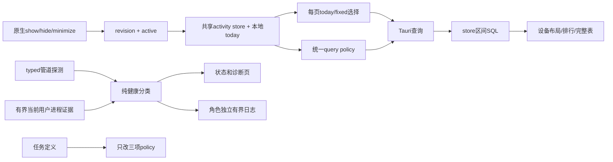

# CL Recoder v3：常驻可靠性、诊断与统计体验实施方案

日期：2026-10-01。交付：供workflow调度独立context Coding Agents的工程设计。本文锁定架构、线格式、文件归属和验收；不包含实现方法体或编排脚本。

根目录：`C:\Users\17814\Documents\cl recoder`，文中源码路径相对于该目录。Windows执行使用pwsh；产品现有提权辅助仍使用Windows PowerShell 5.1，不能借终端要求改产品运行时。

优先级：用户本轮需求 > 本文明确变更 > 当前工作树 > 旧DEVPLAN/PLAN。基线含correctness-v2、heap fix、用户未提交改动，禁止回退。旧合同未被本文覆盖者继续有效。

## 1. 整体设计理念

### 1.1 目标与需求边界

| ID | 目标 | 决定的行为 |
|---|---|---|
| R1 | 持续采集 | 任务无执行时限，允许电池启动且不因切电池停止；提供修复既有任务的入口 |
| R2 | 故障可诊断 | 有界本地日志；区分确实未运行、权限问题、管道不可达、证据不足；不以一次超时自动强杀进程 |
| R3 | 降低后台开销 | 仅窗口可见且未最小化时执行UI查询；隐藏保持采集；取消持续数值/图表动画 |
| U1 | 默认今日 | 仪表盘、键盘、鼠标、手柄、应用、组合键进入时默认今日；“今日”跨日跟随，手选范围保持固定 |
| U2 | 正确手柄标签 | 保留17码及采集逻辑；3=Y、4=X、5=LB、6=LT、7=RB、8=RT。用户已确认TL指RB |
| U3 | 应用统计时长单位 | 存储/API仍为秒；全部可见应用时长用天/小时/分/秒，排序仍用数值；导入/探测诊断耗时保留毫秒 |
| U4 | 更直观统计 | 设备页用参考物理布局与直接次数；应用/组合/WP排行用简洁列表；完整表格继续可访问 |

WhatPulse是历史镜像、设置导出是批量操作，二者保留90天默认。明确不新增热力图、DirectInput/PS/Switch支持、云同步、额定寿命功能、时钟/休眠引擎重写或数据库缓存表。

### 1.2 已核查事实

- `runtime-diagnosis-20261001.md/json`：修复版collector正常；20次管道探测均成功；SQLite quick_check=ok。任务仍为72小时/禁止电池，GUI+WebView2短时CPU约0.977%（24逻辑核归一化），collector约0.044%。这是可见窗口附近的短采样，不是内存泄漏证据或隐藏场景基线。
- 当前本软件六类页初始化30天；WP/导出90天。公共defaultRange(days)不能改成无条件今日。
- `keylabel.rs`及mock将X/Y标错，肩键内部枚举名泄漏成LT/LT2/RT/RT2；collector持久code正确，历史无需交换。
- Apps/WhatPulse表格已fmtDuration；Apps柱图仍把数值、轴与tooltip显示成秒。修复展示，不改前台时长聚合。
- Overview.devices当前SUM全部历史，却被Dashboard标为范围累计；本轮默认今日必须同时纠正此读口径，否则页面仍会混入历史。
- 窗口关闭是hide，不卸载React；Sidebar和当前页会继续轮询。失焦与隐藏不是同一状态。

### 1.3 架构决策与必要性

保持collector/GUI两进程和SQLite schema v2。新增一个小型共享diagnostics crate复用已有依赖，避免两进程复制文件轮转实现，也不把IO放进core/store。现有日志、权限、时限问题与统计引擎分开处理。

原生窗口状态是UI活动的唯一权威；前端共享一个activity store，同时维护本地日期，避免各页定时器与后台探测。默认今日是显式模式而不是简单比较日期值。

设备图按kind/code定位，使用CSS/本地SVG，不依赖型号外观识别、不按频率染色。排行列表保留比较轨道与精确值，取消复杂坐标轴/反复动画。数据求和留在SQL，前端仅做查找、排序、分页和图形几何。

### 1.4 设计原则

1. 保留输入边沿、物理来源隔离、手柄阈值、暂停、flush重试与heap安全封装。
2. 设备型号身份、SQLite表、字段、导出v2及秒数存储不变；只有Overview.devices.total明确改为区间总量。
3. 状态证据不足不宣称未运行；不可达不等于采集已停止；禁止自动taskkill /IM。
4. 日志不成为业务失败来源，不记录原始输入、键码、组合序列、应用切换流水；不发送网络。
5. 所有关键数量可直接读取；焦点可见，读屏有名称；不能只靠颜色/hover。
6. 任务定义更新对后续实例生效，不承诺旧执行实例立即获得新策略。[微软执行时限](https://learn.microsoft.com/en-us/windows/win32/taskschd/tasksettings-executiontimelimit)、[更新实例边界](https://devblogs.microsoft.com/scripting/use-powershell-to-configure-scheduled-task/)

## 2. 系统架构设计

### 2.1 模块职责

| 模块 | 新增/修改职责 | 禁止 |
|---|---|---|
| 新diagnostics crate | 两个独立角色文件、有界JSONL轮转、受控log facade适配 | 统计/GUI/任务/网络逻辑，core IO |
| collector main/ipc | 单实例成立后初始化日志；记录启动退出、DB/IPC故障与重建 | 逐输入日志、改变IPC协议、重做引擎 |
| GUI collector_health | 纯健康分类、进程/任务证据类型与有界探针 | 解析中文错误判断类别、结束collector |
| GUI collector_ctl | typed pipe错误、缓存失败补查、任务修复命令、安全启动 | 一次超时后强杀、500ms一轮PowerShell进程扫描 |
| 任务policy helper/安装脚本 | 纯XML三项策略变换，创建/更新编排与回读 | 改既有账户/触发/动作/其他Settings、repair时启动/停止任务 |
| 原生ui_activity | 实际窗口visible/minimized快照及版本事件 | 用focused代替visible、查询DB |
| UI activity store/provider | 订阅快照、拒绝旧版本、统一活动/本地日期 | 新500ms可见性轮询、跨页全局range覆盖用户选择 |
| store reader | 区间设备总量、按id读kind | 修改schema、前端重复SUM |
| keylabel/core注释/mock | 统一17码物理标签 | 改枚举值、交换历史count |
| UI范围/格式/布局/排行 | 今日模式、时长格式、物理布局和完整列表 | 秒转字符串存储、按label定位、丢未知编码 |

### 2.2 数据与状态流



collector继续独立采集，UI activity不传给collector，不等价paused。日志失败不阻断查询、启动、采集或flush。

## 3. 文件级设计与允许范围

表内是源码完整允许清单。花括号组表示同一目录中分别展开的文件，不允许扩到相邻文件；文档交付为本文件及评审记录。

| Stage | 文件 | 作用/接口归属 |
|---|---|---|
| S1 | `Cargo.toml`、`Cargo.lock` | 新workspace成员/本地包锁记录；不升级第三方版本 |
| S1 | 新`crates/diagnostics/Cargo.toml`、新`crates/diagnostics/src/lib.rs` | §4.1共享有界日志 |
| S1 | `crates/collector/Cargo.toml`、`src-tauri/Cargo.toml` | 仅新增diagnostics路径依赖 |
| S1 | `crates/collector/src/main.rs`、`crates/collector/src/ipc_server.rs` | 初始化/生命周期与生产IPC失败日志 |
| S1 | 新`src-tauri/src/commands/diagnostics.rs` | GUI日志状态、旧macro适配、日志目录命令 |
| S1/S3 | `src-tauri/src/main.rs` | S1诊断初始化；S3原生活动桥；必须串行 |
| S1/S2/S3 | `src-tauri/src/commands/mod.rs` | 对应命令注册；按stage串行追加 |
| S2 | 新`scripts/collector-task-policy.ps1`、`scripts/install-collector-task.ps1` | 三项策略纯函数及create/repair编排 |
| S2 | 新`scripts/tests/collector-task-policy.tests.ps1` | 无Pester依赖的断言/假任务runner |
| S2 | `src-tauri/tauri.conf.json` | bundle.resources增加policy helper，不改其他构建设置 |
| S2 | 新`src-tauri/src/commands/collector_health.rs`、`src-tauri/src/commands/collector_ctl.rs` | typed错误、证据、classification、安全启动/repair |
| S2 | `ui/src/api/types.ts`、`ui/src/api/client.ts`、`ui/src/api/mock.ts` | 新增健康、任务和日志契约/包装/mock |
| S4 | `ui/src/api/types.ts`、`ui/src/api/mock.ts`、`ui/src/api/client.ts`、`src-tauri/src/commands/wp.rs` | 区间mock语义；client仅向两个WP鼠标mock透传日期；WP只读身份字段，依赖S2 |
| S3 | 新`src-tauri/src/ui_activity.rs` | §4.4原生状态+内存命令 |
| S3 | 新`ui/src/api/activity.ts`、新`ui/src/lib/appActivity.ts`、新`ui/src/lib/AppActivityProvider.tsx`、新`ui/src/api/queryPolicy.ts`、`ui/src/main.tsx` | 桥、纯store、React入口、先交付共享查询策略 |
| S3 | 新`ui/tests/app-activity.test.mjs` | 订阅/快照竞态、午夜、QueryObserver gating |
| S4 | `crates/store/src/reader.rs`、`src-tauri/src/commands/keys.rs`、`src-tauri/src/commands/overview.rs` | 区间总量、按id kind、读口径回归 |
| S5 | `crates/core/src/codes.rs`、`crates/collector/src/gamepad.rs` | 只改肩/扳机注释和映射断言，不改计数分支 |
| S5 | `src-tauri/src/keylabel.rs`、`src-tauri/src/commands/keys.rs`、`ui/src/api/mock.ts` | 正式/历史查询/mock标签统一；依赖前一写入者 |
| S6 | 新`ui/src/lib/statisticsRange.ts`、新`ui/src/lib/useStatisticsRange.ts`、`ui/src/lib/format.ts`、`ui/src/components/DateRangePicker.tsx` | §4.5/4.7范围模式及时间显示 |
| S6 | 新`ui/tests/presentation-contracts.test.mjs`、`ui/package.json` | 格式/范围纯回归，脚本逐步加入已有测试 |
| S7 | 新`ui/src/lib/deviceLayouts.ts`、新`ui/src/lib/ranking.ts` | 纯控件几何、定位/导航与排行几何 |
| S7 | 新`ui/src/components/DeviceLayoutStats.tsx`、新`ui/src/components/RankedList.tsx`、`ui/src/components/DataTable.tsx`、`ui/src/theme.css` | 新呈现/分页/样式 |
| S7 | 新`ui/tests/device-layouts.test.mjs`、`ui/package.json` | 17/9/104布局、未知码、分页/排行数据合同 |
| S8 | `ui/src/components/Sidebar.tsx`、`ui/src/pages/Settings.tsx` | 新健康文案、诊断日志目录、自启repair；导出90天不改 |
| S9 | `ui/src/api/queries.ts` | 将既有hooks接到S3已交付policy，覆盖其Sidebar/Settings调用者 |
| S9 | `ui/src/pages/{Dashboard,Apps,Combos,WhatPulse,Gamepad}.tsx`、`ui/src/components/DeviceStatsPage.tsx` | 今日/排行/物理布局/活动接线；WP仍历史默认 |
| S9 | `ui/src/components/TrendChart.tsx` | 单点可见、关闭数据动画 |
| S10 | 新`ui/tests/runtime-ui-integration.test.mjs`、`ui/package.json` | 最终page契约/QueryObserver集成回归 |

保留旧TopBarChart文件，不再被统计页import；不为删旧组件扩清理工作。ChartTooltip继续仅服务事件数趋势，无时长图表输入，无需改它。Keyboard/Mouse页面只是共享页包装，不必改。

新增第三方依赖：**零**。新crate包名固定`clrecoder-diagnostics`，Rust引用为`clrecoder_diagnostics`。仅复用workspace内chrono/serde/serde_json/log，log显式启用已有std feature保证独立crate的adapter接口可编译；其他依赖不变。新crate与三处Cargo文件及lock的本地记录属于本文明确授权例外，不是允许升级依赖。UI lockfile不改，package只改scripts。

## 4. 接口与数据结构（可单独传给下游）

### 4.1 diagnostics crate

```rust
#[derive(Debug, Clone, Copy, Serialize)]
#[serde(rename_all="lowercase")]
pub enum Role { Collector, Gui }
#[derive(Debug, Clone, Copy, Serialize)]
#[serde(rename_all="lowercase")]
pub enum Level { Info, Warn, Error }
pub struct LogConfig { pub directory: PathBuf, pub role: Role }
pub struct DiagnosticLog { /*私有Mutex、文件与状态*/ }
#[derive(Debug, Clone)]
pub struct LogState { pub available: bool, pub last_error: Option<String> }
pub fn DiagnosticLog::open(config: LogConfig) -> Result<DiagnosticLog, std::io::Error>;
pub fn DiagnosticLog::record(&self, level: Level, code: &str, message: &str) -> bool;
pub fn DiagnosticLog::state(&self) -> LogState;
pub fn install_project_log_adapter(log: Arc<DiagnosticLog>, debug_stderr: bool)
    -> Result<(), log::SetLoggerError>;
```

方法签名是设计声明，不是实现片段。每进程一个角色sink：collector.log/gui.log，当前文件256KiB、仅一份 `.1` 备份；总计约1MiB，最终UTF-8整条JSONL（含换行）≤2048字节。code≤64字节，CR/LF不成为新记录；截断message必须保留合法JSON和UTF-8，不能粗切JSON尾部。

记录形状完整：`{time:string(RFC3339),pid:u32,role:"collector"|"gui",level:"info"|"warn"|"error",code:string,message:string}`。不增加任意RawEvent payload。

- open/record失败只更新内存state/回退stderr，不抛panic、不递归记录自身失败、不影响业务结果。
- 锁内轮转并写；轮转失败不能无界继续append，跳过该次并标不可用。只操作本角色文件和备份，不递归删除目录。
- adapter只持久化本项目目标的Warn/Error；第三方与默认Info/Debug不原样落盘。必要Info使用record显式代码：`service.started`、`service.stopped`、`task.policy_updated`、`collector.health_changed`、`collector.health_recovered`。
- 成功status不逐次写；按**稳定事件code**限频，不以包含计数/路径的message作key：前63个code各一个桶，其余code永久走一个共享overflow桶，共64项；进程内不淘汰/迁移桶，避免已写overflow事件转入独立桶绕过60秒间隔。每桶按最近真正写入时间60秒最多一条，message可变化。adapter code来自固定项目target/受控事件类别，不从完整文案生成。健康变化/恢复才有资格入日志，仍受该限频；抑制不将logging available标为false。
- 不记录输入键码/按钮/组合、前台exe流水、RawEvent、逐条计数、导入行内容。stderr debug可沿用原诊断习惯，不以CLRECODER_DEBUG决定持久日志是否启用。
- 先解析mode，生产Run**不得先调用旧env_logger初始化**：仅取得单实例guard后开文件并安装新adapter一次。selftest单独初始化既有stderr logger，Version/Help不碰生产日志。sink失败才明确stderr-only降级；adapter安装失败必须记录/报告不可用，不能忽略SetLoggerError后宣称持久日志已接线。GUI仅single-instance插件成立后的setup初始化，再构造AppState，防止同角色两个进程争轮转。
- collector.main最终不能在日志flush之前直接exit；正常结束以同步写完成，不新增后台logger线程。原生异常仍需Windows事件/dump，日志不承诺捕获所有堆损坏。

GUI诊断命令（outer DTO camelCase）：

```rust
pub struct GuiDiagnosticsState {
    pub log: Option<Arc<DiagnosticLog>>,
    pub directory: Option<PathBuf>,
    pub init_error: Option<String>,
}
#[derive(Serialize)]
#[serde(rename_all="camelCase")]
pub struct DiagnosticsInfoDto {
    pub log_directory: Option<String>,
    pub gui_logging_available: bool,
    pub last_error: Option<String>,
    pub max_total_bytes: u64, // 1_048_576
}
pub fn init_gui_diagnostics() -> GuiDiagnosticsState;
pub fn record_gui_message(args: std::fmt::Arguments<'_>);
pub async fn get_diagnostics_info(state:tauri::State<'_,GuiDiagnosticsState>)
    -> Result<DiagnosticsInfoDto,String>;
pub async fn open_diagnostics_directory(app: tauri::AppHandle) -> Result<(),String>;
```

State只由Tauri注入，不进入invoke参数；两个命令前端均无参数。record_gui_message是旧gui_log! macro适配入口：按现有INFO/WARN/ERROR前缀识别受控级别，去掉前缀后使用固定gui事件码，未识别文本按Info，仍受单条/限频合同；不得解析健康错误种类。目录由后端固定LocalAppData/ClRecoder/logs，使用既有opener Rust接口打开，不能接受任意前端路径。Info仅说明GUI sink；不得因此宣称另一个进程的collector sink必可写。

### 4.2 typed健康与控制合同

```rust
#[derive(Debug, Clone, Copy, PartialEq, Eq, Serialize)]
#[serde(rename_all="snake_case")]
pub enum Evidence { Present, Absent, Unknown }
#[derive(Debug, Clone, Copy, PartialEq, Eq, Serialize)]
#[serde(rename_all="snake_case")]
pub enum CollectorHealth { Running, Paused, NotRunning, Unreachable, AccessDenied, Unknown }
pub enum PipeFailureKind { NotFound, AccessDenied, Busy, Timeout, Io, Protocol, WorkerUnavailable }
pub struct CtlError { pub kind: PipeFailureKind, pub message: String }
pub enum PipeProbe { Status { paused: bool }, Failed(PipeFailureKind) }
pub fn classify_health(pipe: PipeProbe, process: Evidence) -> CollectorHealth;
```

纯分类归collector_health；typed transport归collector_ctl。新私有 `ctl_request_typed(&CtlRequest)->Result<CtlResponse,CtlError>`；旧 `ctl_request(&CtlRequest)->Result<CtlResponse,String>`保留转换包装。不能通过中文字符串解析错误种类。

`CollectorStatusDto`/TS CollectorStatus新增字段，完整UI线形状：

```typescript
type Evidence = "present" | "absent" | "unknown";
type CollectorHealth = "running" | "paused" | "not_running" |
  "unreachable" | "access_denied" | "unknown";
type CollectorDiagnosticCode = "pipe_not_found" | "pipe_access_denied" |
  "pipe_busy" | "pipe_timeout" | "pipe_io" | "pipe_protocol" |
  "probe_unavailable" | null;
interface CollectorStatus {
  running: boolean; // 保留旧语义：本次成功取得有效status
  taskExists: boolean; // true只在存在证据成立；unknown时false仅作legacy
  taskEvidence: Evidence;
  health: CollectorHealth;
  pipeReachable: boolean;
  processEvidence: Evidence;
  diagnosticCode: CollectorDiagnosticCode;
  diagnosticMessage: string | null;
  paused?: boolean;
  startedAt?: string;
  lastEventAt: string | null;
}
```

规则：

| 证据 | health |
|---|---|
| 有效status且paused=false/true | running/paused，running=true、pipeReachable=true；无需进程补查 |
| AccessDenied | access_denied，不宣称未运行 |
| 任意失败且确认本用户进程Present | unreachable（AccessDenied优先） |
| NotFound且确认本用户进程Absent | not_running |
| Timeout/Busy/Io/Protocol与Absent组合 | unknown，不能排除探测竞态 |
| 进程证据Unknown | unknown（AccessDenied仍优先） |

成功status时processEvidence=present（可响应的本用户管道服务是当前证据），diagnosticCode/message=null；失败时不回填旧paused/startedAt为当前事实。诊断文字可以改善，稳定短码不改。

默认health/taskEvidence/processEvidence为unknown，不以默认false先显示未运行。失败diagnosticCode保留原pipe短码；进程补查不可用反映在processEvidence/message，不吞掉原pipe类别。WorkerUnavailable映射probe_unavailable。

进程补查只在pipe失败时：使用当前用户SID，CIM候选镜像owner SID分为own/foreign/unknown计数；有own→Present，无own但有未知→Unknown，确认全无本用户且无未知→Absent。不得把别账户同名进程认作本用户实例。

内部探针JSON固定 `{queried:bool,ownCount:number,foreignCount:number,unknownCount:number}`；当前SID获取复用已有Win32 Security API的正确字节/对齐合同。PowerShell子进程限1500ms，超时只结束本次自建探针child，证据Unknown；stdout上限32KiB、stderr不参与语言解析。进程证据TTL5秒并single-flight，任务证据TTL30秒沿用缓存。500ms仍只约束pipe请求，不承诺整个带补查命令≤500ms。

安全启动：START_LOCK、无Wait直启、有限脚本Wait及账户DACL保持。**删除自动/IM强杀和“瞬时不通就是僵尸”的分支**：若Own进程Present但未就绪，等待5秒；仍不可达则返回可解释错误，不杀进程/不重复runas。权限拒绝/Unknown也不自动杀。Absent才进入schtasks优先→有界就绪→必要runas；失败后补查若进程已存在则停止重试。没有新自动重启策略。

本轮每次启动流程最多一次直接runas。旧correctness_v2的“两fallback源码计数”测试应替换为新策略行为断言：仍使用start_direct_with、Present/Unknown不重复launch、失败错误可解释；不是简单删测试/取消helper安全断言。脚本Wait、直启无Wait、路径/启动锁测试继续有效。

### 4.3 任务策略与修复接口

三个设置固定：`ExecutionTimeLimit="PT0S"`、`DisallowStartIfOnBatteries=false`、`StopIfGoingOnBatteries=false`。

policy helper：`Get-CollectorTaskPolicyXml([xml]$Definition) -> [xml]`返回深克隆，只修改/补齐三个命名空间节点；原XML不变，重复应用等价。注册/账户/动作/触发/其它Settings/安全描述符保留。

安装脚本参数保持CollectorPath/TaskName，新增 `[switch]$RepairOnly`、`[string]$ExpectedUserSid`。ExpectedUserSid由GUI后端可信获取并传入；手动缺省取当前身份。提权身份SID不同于预期则失败，不悄悄创建其它账户任务。产品仅保证同用户管理员分离令牌场景，异账户管理员凭据不在本轮补支持。

- 创建：仅任务不存在时沿用既有创建方式；先设置并回读三项，再/Run；失败不能宣称安装成功。
- 已存在：COM读取原定义与安全描述符，应用纯XML，更新并回读，不/Create /F重建。TaskName当前SID/interactive principal校验不满足则报明确冲突，不能覆盖其他账户定义。
- COM更新flags固定 `TASK_UPDATE | TASK_DONT_ADD_PRINCIPAL_ACE | TASK_IGNORE_REGISTRATION_TRIGGERS = 0x34`，传原principal/logonType及原SDDL，回读确认owner/group/DACL等价（可规范化文本，不靠字符串顺序）。不能传空SDDL冒充保全。仅支持本项目当前用户InteractiveToken、仅LogonTrigger定义；发现Registration/Time/Calendar/Boot等额外触发或无法取得必要权限信息则只读报冲突，不修改。这样RepairOnly不会因更新动作触发注册/时间任务。[微软注册flags](https://learn.microsoft.com/en-us/windows/win32/taskschd/taskfolder-registertask)
- RepairOnly：任务必须存在；不要求重新定位collector文件；只更新策略，不/Run，不结束任何进程。
- GUI `pub async fn collector_autostart_repair(app:tauri::AppHandle) -> Result<(),String>`，前端无参数，有限脚本一次UAC且等待退出码；成功仅表示定义校验通过，不表示当前实例已重启。
- 新 `pub async fn get_collector_task_policy() -> Result<TaskPolicyDto,String>`，仅Settings活动时查询，不随500msstatus重复。TaskPolicyDto逐字段对应下面TS形状，snake_case Rust字段以camelCase序列化；applies_on_next_start固定true。证据未知返回evidence=unknown及可空字段，非阻塞helper不在UI线程运行。

```typescript
interface TaskPolicy {
  evidence: Evidence;
  executionTimeLimit: string | null;
  disallowStartIfOnBatteries: boolean | null;
  stopIfGoingOnBatteries: boolean | null;
  compliant: boolean | null;
  appliesOnNextStart: true;
}
interface DiagnosticsInfo {
  logDirectory:string|null;
  guiLoggingAvailable:boolean;
  lastError:string|null;
  maxTotalBytes:number;
}
// client.ts导出；mock.ts同线形状，控制mock不能触发真实环境操作。
function getCollectorTaskPolicy():Promise<TaskPolicy>;
function collectorAutostartRepair():Promise<void>;
function getDiagnosticsInfo():Promise<DiagnosticsInfo>;
function openDiagnosticsDirectory():Promise<void>;
```

使用既有install脚本经静态RepairOnly参数调用，维持引号/空格路径安全；helper打包为scripts/collector-task-policy.ps1。没有权限提升的自动启动时修复，修复由用户点击按钮发起。

### 4.4 原生活动与前端共享store

```rust
#[derive(Clone, Serialize)]
#[serde(rename_all="camelCase")]
pub struct UiActivitySnapshot { pub revision: u64, pub active: bool }
pub struct UiActivityState { /*Mutex缓存快照，初始inactive*/ }
pub async fn get_ui_activity(state: tauri::State<'_,UiActivityState>)
  -> Result<UiActivitySnapshot,String>;
```

事件名固定 `ui-activity`，payload同快照，仅emit到main。active=实际is_visible && !is_minimized；失焦但可见保持true。原生setup建立状态；show_main、首启show、关闭hide之后显式更新；Focused/Resized读取实际状态，Destroyed置inactive。读失败按inactive降级并记录诊断，不让错误触发高频轮询。

版本在状态变化时单调增加，getter只返回缓存，不用后台getter重采样覆盖较新事件。Native事件和显式show/hide统一发布；失败无panic。没有新定时探测窗口。

```typescript
interface ActivitySnapshot { revision: number; active: boolean }
interface AppActivity { ready: boolean; active: boolean; today: string; error: string | null }
interface ActivityBridge {
  subscribe(handler:(s:ActivitySnapshot)=>void):Promise<()=>void>;
  snapshot():Promise<ActivitySnapshot>;
}
interface ActivityClock {
  now():Date;
  setTimeout(fn:()=>void, milliseconds:number):unknown;
  clearTimeout(handle:unknown):void;
}
class AppActivityStore {
  constructor(bridge:ActivityBridge, clock:ActivityClock, onWillActivate?:()=>void);
  getSnapshot():AppActivity;
  subscribe(listener:()=>void):()=>void;
  start():Promise<void>;
  stop():void;
  refreshDate():void;
}
function useAppActivity():AppActivity;
// api/activity.ts导出；Tauri与Browser mock在此适配，组件不自行listen。
function createActivityBridge():ActivityBridge;
// AppActivityProvider.tsx：生产store由Provider初始化/清理，共用既有QueryClient。
function AppActivityProvider(props:{children:React.ReactNode}):React.ReactElement;
```

先注册listener，再取快照；旧revision/旧start generation忽略。stop包含延迟resolve的unlisten与timer清理；getSnapshot引用仅真正变化时更新，供useSyncExternalStore使用。

未接收版本用null表示，首个revision=0/inactive也必须接受并ready=true；同版本重复不回退状态。并发start返回同一pending启动，不重复注册；健康started再start幂等。snapshot失败但已经接受有效event时保留该权威状态；尚无有效event则ready=true/active=false/error，listener保持可用，retry只补快照不加第二监听；listener注册失败才重做订阅。stop后旧generation的返回不得重新激活。

初始ready=false/active=false，阻止隐藏启动首轮查询。进入active时**同一个状态发布**先重算本地today，再active=true；onWillActivate先标所有`meta.uiOwned=true`缓存stale（refetchType:none），后发布，以新范围恢复查询。初始化失败ready=true/active=false/error可见并提供重试；不伪造Tauri可见。

Provider自己的错误提示/重试按钮不依赖任何数据query，inactive时也能调用store.start；不得把重试入口放进enabled=false的Settings查询结果后面。

活动期只安排下一本地午夜的一次timer（当地日历构造，非固定24小时）；隐藏取消，恢复重新计算。DOMfocus/pageshow/visibilitychange仅校准日期，不作为Tauri active权威。Browser mock桥可以使用document visibility，不连接真实Tauri/DB。

### 4.5 范围与查询策略

```typescript
type Range = { from:string; to:string }; // 合法本地日YYYY-MM-DD，闭区间，from<=to
type StatisticsRangeSelection = { mode:"today" } | { mode:"fixed"; range:Range };
type RangeChangeMode = "today" | "fixed";
function resolveStatisticsRange(selection:StatisticsRangeSelection, today:string):Range;
function selectStatisticsRange(range:Range, mode:RangeChangeMode):StatisticsRangeSelection;
function useStatisticsRange(): {
  range:Range; selection:StatisticsRangeSelection;
  onChange:(range:Range,mode?:RangeChangeMode)=>void;
};
interface UiQueryPolicy {
  enabled:boolean; refetchInterval:number|false;
  refetchIntervalInBackground:false; staleTime:0;
  meta:{uiOwned:true};
}
function uiQueryPolicy(active:boolean, interval?:number, live?:boolean):UiQueryPolicy;
interface DateRangePickerProps {
  value:Range;
  onChange:(range:Range,mode?:RangeChangeMode)=>void;
}
function DateRangePicker(props:DateRangePickerProps):React.ReactElement;
```

纯range模块只type import，不读取时钟。默认today，from=to=同一次today采样；手动输入/非Today preset用fixed，之后午夜不改；点击Today恢复follow。DateRangePicker onChange第二参数optional，旧WP/导出setter忽略它，公共defaultRange(days)保持显式天数含义。

useStatisticsRange只持有selection；range在同次render中直接用activity.today派生，不能用useEffect维护第二份range状态，防止恢复时一帧旧day已enabled。S3先交付queryPolicy模块；S8新增taskPolicy/diagnosticsInfo直接useQuery即消费它，S9再统一既有hooks。

所有查询（含Sidebar、settings和WP）加uiOwned及activity gating。active时overview/status500ms、devices2秒、设备TopKeys/鼠标距离/Apps/Combos1秒；统计interval仅range包含当前today时启用，历史固定范围不轮询。WP/Settings不新加interval，但inactive禁止focus/invalidation发请求。已有正在执行的一次请求允许完成，不扩I/O取消。

uiQueryPolicy默认live=true；enabled=active，只有active且live且提供interval时返回该interval，其余false。页面既有enabled条件与policy.enabled取AND（例如有device且展开）；不能被spread顺序覆盖为true。meta合并保留uiOwned；staleTime=0确保重新启用后刷新，不引入后台refetchIntervalInBackground。

DeviceStatsPage TopKeys请求limit=65536（u16完整值域，SQL仍GROUP BY code），不能继续Top200把缺席的已计数键画成0。keyDaily只在“逐日明细”展开且active时查询；其period同上。跨设备/范围不使用keepPreviousData，先显示加载状态，不在新标题下显示旧数字。

Dashboard/Apps/Combos跨范围同样不展示旧range placeholder。同key普通刷新可显示缓存。WP历史placeholder保留但明确更新中。页面重新进入因原key={page}卸载，重新默认今日；不新增路由/全局range store。

### 4.6 读口径与手柄完整表

新增store `device_kind_by_id(conn:&Connection,id:i64)->Result<Option<DeviceKind>>`，主键查kind不计算全历史SUM；keys层复用None到原UnknownDeviceKind错误。

`overview(conn,from,to)`签名和DTO形状保持，**devices[].total改为所选闭区间SUM**；LEFT JOIN日期条件必须放ON以保留零输入设备。get_devices的DeviceRow.total仍lifetime；S9在DeviceStatsPage紧邻DeviceTabs固定说明“设备标签中的次数为全历史累计，不受日期筛选影响；下方按所选日期统计”，不改DeviceTabs昵称交互或清单外文件。Overview.today仍to日拆分。schema/导出/API秒数不变。

为新排行和既有WP明细提供稳定身份，WP只读DTO保留来源主键，新增两个字段（不改变SQL统计）：

```typescript
interface WpKeyRow { day:string; qtKey:number; label:string; count:number }
interface WpAppRow { day:string; path:string; name:string; seconds:number; keys:number; clicks:number }
```

Rust对应WpKeyRow加qt_key、WpAppRow加path，camelCase输出；来自既有reader行，不猜label。WPKeys id=day:qtKey，WPApps表rowKey=day:path；同名不同Qt码/路径不能冲突。WP排行仍逐日行，名称附日期，标题明确“逐日高频项”，不在前端跨日SUM。Mock必须产生合法day/qtKey/path，范围无数据返回空，不能继续空day聚合假装逐日记录。

WPOverview.appsTotal（旧字段名保留）在真实后端是**范围内应用前台秒数总和**，不是条目数量；S4 mock必须以全部范围内应用日行计算该秒总和，不受Top-N截断影响；S9 KPI标题改“应用前台时长”并fmtDuration。数据字段/单位不再猜测。

所有日期相关mock使用可重复fixture：WP keys/combos都返回合法day且无活动日为空；`mockWpMouseButtons(from:string,to:string,limit:number)`与`mockWpMouseScrolls`同签名，client从原有from/to透传，无活动日返回[]；自有mockMouseDistance按收到from/to生成days/totalInches，不能保留固定Sept27/28。mock聚合是模拟后端职责，真实前端不新增SUM。正式invoke/SQL/查询前缀保持。

CSV列不变；JSON whatpulse.keys/apps会多出qtKey/path，属于版本2的新增身份字段，不删改既有属性或rows计数，旧文件不回写。没有项目JSON反向导入器，不做推断补全。

| code | 短标签/物理位置 | 正式查询和mock完整标签 |
|---:|---|---|
|1|A，下|A（南）|
|2|B，右|B（东）|
|3|Y，上|Y（北）|
|4|X，左|X（西）|
|5|LB，左肩|LB（左肩）|
|6|LT，左上扳机|LT（左扳机）|
|7|RB，右肩|RB（右肩）|
|8|RT，右上扳机|RT（右扳机）|
|9|View，中心左|View（选择）|
|10|Menu，中心右|Menu（开始）|
|11|Guide，中心|Guide|
|12|LS，左摇杆|左摇杆按下|
|13|RS，右摇杆|右摇杆按下|
|14/15/16/17|十字上/下/左/右|十字上/十字下/十字左/十字右|

North=3/West=4和Rust枚举LeftTrigger=5/LeftTrigger2=6等**数值/名称不改**，只修注释/显示。映射主证据为本机gilrs-core0.6.8 XInput源码：X→WEST、Y→NORTH、肩→LT/RT、模拟→LT2/RT2。数据库不存这些label，旧数据查询自然纠正；旧导出文本不回写。

Guide保留控件/code，但当前后端可能不提供事件；页面标注该边界，0不能被当作故障。未知code保留“按钮N”/原键名，鼠标同码仍按kind消歧。

### 4.7 时长格式

fmtDuration仍接收number秒，输出完整非零单位，从天→小时→分→秒；0为0秒，非法非有限值按0，负数截0，非整数向下取整。例：59→59秒；60→1分；90→1分30秒；3599→59分59秒；3600→1小时；3661→1小时1分1秒；90061→1天1小时1分1秒。

表格value仍seconds数值，只有render/排行可见文字、title和aria使用fmtDuration，不改SQL排序和导出。新排行无时间坐标轴/柱尾，完整文本已带单位，不再拼“秒”。WhatPulse应用表及appsTotal KPI同样采用新fmtDuration。ImportReport.durationMs、管道探测/诊断耗时仍是毫秒，U3不把这些操作延迟改成应用统计时长。

### 4.8 设备布局、排行与表格合同

所有排行API既有limit保留（Apps/Combos/WP通常200），因此“完整表”是完整**已查询集合**。顶部必须说明显示Top10/已加载N，达到API上限时说明当前最多200项；不能宣称覆盖全库。设备输入专用limit65536覆盖u16全值域，全部返回项通过分页可访问。

```typescript
type DeviceKind = "keyboard"|"mouse"|"gamepad";
interface DeviceControlSpec {
  id:string; code:number; shortLabel:string;
  zone:string; x:number; y:number; width:number; height:number;
}
interface DeviceZoneSpec { id:string; label:string; width:number; height:number }
interface DeviceLayoutSpec { kind:DeviceKind; zones:readonly DeviceZoneSpec[]; controls:readonly DeviceControlSpec[] }
interface TopKeyRow { code:number; total:number; label:string }
type NavigationKey = "ArrowUp"|"ArrowDown"|"ArrowLeft"|"ArrowRight"|"Home"|"End";
// deviceLayouts.ts：模板查找；控件code查找；区内roving导航，无DOM/API依赖。
function getDeviceLayout(kind:DeviceKind):DeviceLayoutSpec;
function nextControlId(layout:DeviceLayoutSpec,currentId:string,key:NavigationKey):string;
function getUnmappedRows(kind:DeviceKind,rows:readonly TopKeyRow[]):TopKeyRow[];
interface DeviceLayoutStatsProps {
  kind:DeviceKind; rows:TopKeyRow[]; title:string;
  loading?:boolean; selectedCode:number|null;
  onSelect:(code:number|null)=>void;
}
interface RankRow { id:string; label:string; value:number }
interface RankedListProps {
  title:string; rows:RankRow[]; fullTable:React.ReactNode;
  formatValue?:(value:number)=>string; unit?:string;
  labelHeader?:string; valueHeader?:string;
  queryLimit?:number;
}
interface RankedItem extends RankRow { rank:number; fraction:number }
// ranking.ts：降序/稳定同值次序，最多10行，fraction属于[0,1]，全0则0。
function rankTopRows(rows:readonly RankRow[]):RankedItem[];
function DeviceLayoutStats(props:DeviceLayoutStatsProps):React.ReactElement;
function RankedList(props:RankedListProps):React.ReactElement;
```

布局纯数据只有本轮固定keyboard/mouse/gamepad，kind/code唯一。位置单位由模板定义，允许分数；单按钮至少44×44显示单元，布局区可wrap但不缩到不可读字号。

- keyboard：ANSI104参考；功能13、主键61、导航13（含PrintScreen/ScrollLock/Pause）、数字17四区，区内形状/行序忠于参考布局。空间不足导航/数字换到第二行；保持44px控件，最小窗口卡片内宽不足时允许该布局区局部横向查看并给出提示，不缩成小字、不使整个页面溢出。标准标签不声称自动识别实际键盘外观/语言；详情显示后端label和code。
- mouse：中性SVG轮廓，9个独立控件；左/右/中、X1/X2与四滚向各有数字，不把按下与滚动叠成同项。
- gamepad：Xbox参考轮廓，17控件完整；Y上/X左/B右/A下；LB/LT/RB/RT四个分离位置；双摇杆按下、十字方向、View/Menu/Guide明确。
- 每控件姓名/数字直接可见，缺行=0；计数只做code查找，不SUM；没有绘制位置的输入在“其它输入”及完整表中保留，不能只显示Top15。
- 所有填充保持中性，不按频率染色；选择/焦点强调允许。数字可以缩写，详情/aria有精确fmtNum。点击只选查看，不重放输入、不写统计。
- 每区一个Tab入口，区内方向键按半平面最近距离移动（同距按模板顺序），Home/End首末，Enter/Space选择，Escape清选择；Tab进入下一区。无hover也能读数。
- nextControlId以控件几何中心计算；方向无候选保持currentId，Home/End仅当前区首末；currentId不存在返回模板第一个控件。getUnmappedRows保持输入行顺序；rankTopRows同值保留输入顺序，不修改入参数组。例：值[20,10,0]对应rank[1,2,3]、fraction[1,0.5,0]。
- 组件不查询API，DeviceStatsPage管理数据/设备/范围、selectedCode和明细展开；设备/范围语义resetKey变化清selectedCode，组件用受控值画选择。方向键focus与selectedCode独立，Escape经onSelect(null)清选择。

RankedList：Top10行，行含名次、可换行名称、右对齐完整值及4px细比较轨道；轨道用value/topMax做显示几何，不做数据求和/占比。值变化无过渡/入场动画，稳定id而非label/index作key。下面默认展开完整表，可主动折叠，但不能只给一个截断摘要。Apps id=exe，Combos id=mods:code，WP keys id=day:qtKey，WP combos id=day:combo（WP返回逐日行，不假装已做跨日排行合并）。

S9把请求limit传queryLimit（当前Apps/Combos/WP为200）；组件永远显示Top10/已加载N，当rows.length>=queryLimit额外显示“本次最多加载N项”，不声称已证明库内更多行。无法从rows自行猜查询上限。

DataTable增加 `pageSize?:number`、`resetKey?:string`，有pageSize时分页、不能同时renderLimit。设备全量与逐日表pageSize=50；排序/语义resetKey变化回第一页，普通轮询行值变动不重置，页数缩小时clamp。所有查询返回行均可通过翻页访问；不新增虚拟列表框架。

```typescript
interface Column<T> {
  key:string; header:string; value:(row:T)=>string|number;
  render?:(row:T)=>React.ReactNode; numeric?:boolean; sortable?:boolean;
}
type SortDir = "asc"|"desc";
interface DataTableProps<T> {
  columns:Column<T>[]; rows:T[]; rowKey:(row:T,index:number)=>string;
  initialSort?:{key:string;dir:SortDir}; empty?:React.ReactNode; caption?:string;
  renderLimit?:number; pageSize?:number; resetKey?:string;
}
function DataTable<T>(props:DataTableProps<T>):React.ReactElement;
```

rowKey的index参数仅保留旧调用兼容，新调用必须用上述稳定身份。分页的页号属于组件私有实现；对外不引入页号状态/回调。

Dashboard仅单日时隐藏无意义的每日趋势卡；多日时保留趋势，只有一个有数据点也显示dot。所有剩余Recharts Line数值更新isAnimationActive=false；只有hover/focus颜色使用现有180ms transition。

## 5. 核心流程

### 5.1 初始、隐藏、恢复、午夜

1. native先管理inactive快照，GUI初始化日志/状态；first-run或托盘show更新实际snapshot。
2. React活动store先listen再getter，未ready不发UI数据query；Browser mock使用本地桥。
3. 显示时计算本地today并使uiOwned缓存stale，原子发布active/today；各本软件页默认today派生正确key并加载。
4. hide/minimize发布inactive，所有UI查询停发，未完成请求可结束；collector保持原PID/paused和采集。
5. restore先校准day再恢复active，不请求旧day；失焦但可见仍刷新。
6. 午夜只更新today模式；fixed仍原范围。路由重新进入默认今日，WP/导出仍90天。

### 5.2 状态和任务修复

1. 状态成功直接分类running/paused；失败根据typed kind补充当前用户证据，缓存/限时，返回准确health。
2. 状态变化/恢复才写日志；Sidebar/Settings按health显示，不用running=false一律未运行。
3. 用户点击“修复采集器自启”：一次UAC、RepairOnly、只改三项并回读。结果刷新taskPolicy和task缓存，不进入启动流程。
4. 界面显示“策略已更新，对后续启动生效；当前采集器未重启”。当前实例可能仍受旧策略约束，部署说明需安排一次受控停止并通过任务新启动，或如实交接未生效状态。
5. 用户立即启动时不自动杀进程；存在且不可达先等就绪，仍失败展示诊断/日志入口。

### 5.3 日志

单实例成立后创建本角色sink；显式startup/stop与受控Warn/Error写JSONL。长度/轮转在同一锁内，重复失败限频；IO异常跳过记录并保留可查询state。正常collector退出同步完成最后日志；heap等原生异常用Windows事件继续辅助诊断。

### 5.4 页面展示

设备/范围变化显示对应加载态，成功后按code更新物理位置，选择显示精确值/编码；未知码和全部记录有完整表。用户展开逐日明细才发其查询。排行按数值秒/次数排序，名字不截断成无法区分；时长仅展示转换，不修改数据。

## 6. 持久化与状态

SQLite schema=2、settings.json形状、秒数存储、input code、导出schema_version=2都不变；不新增数据表。Overview总量读语义明确变化，DeviceRow累计不变。

唯一新增持久数据是本地logs两角色JSONL及一份备份；不写app事件流水或原始输入。任务只改已注册定义三项，不改变账户/触发/动作/SDDL；已有实例生效边界在§5.2。

UiActivitySnapshot、今日/固定选择、布局选择、分页、health缓存只在内存中；不增加settings字段。切页默认恢复今日，用户固定范围只在当前挂载页生命周期保留。

日志目录不可解析/不可写时不降级到任意cwd新建文件；诊断Unavailable，但采集/GUI继续。stdout/stderr和Windows事件仍可作为故障证据。

## 7. 兼容与明确不做的工作

- 保留heap字符长度、DWORD对齐、增长重试与native只读测试；不要回到旧字节除2逻辑。
- 不交换gamepad3/4或5/6/7/8历史count，不重命名枚举，不改触发器计数阈值/数字事件顺序。
- 旧JSON导出里的错误标签不回写；新查询/导出自动复用正确keylabel。
- WP新增qtKey/path身份字段；既有日行不变为跨日聚合，mock必须对齐日行语义，JSON新属性可增加而既有属性/文件版本/CSV保持。
- 保留正常启动的schtasks优先、UAC路径安全、无Wait常驻启动、single-instance、托盘暂停/隐藏；仅取消自动强杀与增加repair入口。
- 不改控制NDJSON线协议。500ms管道守护线程超时后的底层取消/服务worker读超时是既有边界，本轮不重写IO模型。
- 不引入CPU监控后台服务；性能QA是离线采样。此前SQL中位0.034ms不足以支持缓存表或存储架构重写，只做直接kind查询。
- 不把active=false等同用户暂停统计；不卸载/重启WebView作为资源优化。
- 使用现有theme颜色/字体令牌，不加载Google Fonts/CDN/GSAP/图片。ui-ux-pro-max检索支持数据密度、可达性、稳定key和低动画；营销式大标题/超大留白推荐不适用本工具，不采用。

## 8. Stage Map与验收

### 8.1 硬依赖DAG与写入冲突

S1先完成crate/manifest和日志接线，避免并行Cargo看到未发布新成员。之后：S2→S3→S6→S7→S9；S2→S4→S5→S7；S3→S8→S9；S9→S10→S11→S12。

S4/S5与S3/S6可在各自硬依赖完成后并行。main/mod、client/types/mock、keys、package.json等表中共享文件按上述阶段串行；不要只依据“职责不同”并行编辑。workflow可用独立worktree，合并后验收；同树编译应避开其它stage未完成的中间编辑态，不以这种临时失败裁定功能。

### 8.2 可调度关卡

| Stage | 目标/文件见§3 | 硬依赖 | 验收 |
|---|---|---|---|
| S1 | 共享有界日志与两进程接线 | 无 | `cargo test -p clrecoder-diagnostics`；长度/UTF8/JSON合法、轮转上限/失败不无限append、双角色隔离、65类交错变化message限频、IO失败不影响业务；facade Warn/Error确实进角色文件，生产全局logger初始化一次，selftest不写生产日志 |
| S2 | typed健康、任务policy和API/mock | S1 | `cargo test -p cl-recoder commands::collector_health::tests`、`cargo test -p cl-recoder commands::collector_ctl::tests`、`pwsh -NoProfile -File scripts/tests/collector-task-policy.tests.ps1`；纯矩阵/缓存/限时/不强杀；假runner断言三项/flags0x34/SDDL/额外触发拒绝/RepairOnly无Run/Create/Stop；路径与Wait回归 |
| S3 | native activity与前端store、纯queryPolicy | S2 | `cargo test -p cl-recoder ui_activity::tests`、`node --test ui/tests/app-activity.test.mjs`；listener/getter/首0快照/start幂等/失败event保持/迟到unlisten/hidden0请求/失焦/minimize/恢复newtoday/午夜及stop清理；真实policy供QueryObserver |
| S4 | 区间设备量与主键kind、WP身份/mock | S2 | `cargo test -p clrecoder-store`、`cargo test -p cl-recoder commands:: -- --skip import_real_whatpulse_db_when_present`；昨天100今天2/多日102/零输入与lifetime保持、kind/身份/JSON；WP appsTotal秒数不受Top-N、mock日期正确 |
| S5 | 17码正式/mock标签 | S4 | `cargo test -p cl-recoder keylabel::tests`及`cargo test -p cl-recoder commands::keys::tests`；17码表、临时DB 3=31/4=42/5=53/6=64/7=75/8=86标签正确count原样/鼠标不混；collector安全unit保留映射/阈值 |
| S6 | 今日模式/时长/DateRangePicker | S3 | `node --test ui/tests/presentation-contracts.test.mjs`：今日只采样一次、午夜跟随/手选固定/返回Today、WP/export defaultRange90保留、各时长示例与异常值；UI类型构建 |
| S7 | 物理布局/排行/分页 | S5、S6 | `node --test ui/tests/device-layouts.test.mjs`：104/9/17唯一code、X/Y位置、四肩扳机、零/未知码/超长值、导航/排序数值/稳定id、分页reset语义；组件UI编译；视觉等S10实际页面验收 |
| S8 | Settings/Sidebar诊断交互 | S3 | 新taskPolicy/diagnosticsInfo直接query使用S3policy；文案/无凭据误报、existing repair/next-start说明、日志目录、导出90天；失败重试入口不依赖disabled数据query；Browser mock，无真UAC |
| S9 | 全页默认/呈现/后台gating接线 | S7、S8 | 本软件所有页今日，WP90；overview范围量；没有统计页TopBarChart import；完整数据不截丢；all useQuery（含Sidebar/WP/settings）有policy；keyDaily按需；historical无interval；图数更新无动画 |
| S10 | UI整体验证与视觉QA | S9 | `npm --prefix ui test`包含旧WP与新4个文件；新增runtime-ui-integration：真实QueryObserver+fake bridge hidden后不周期fetch、恢复新day一次更新、固定范围不漂、跨设备旧数据不绘制；下面截图清单通过 |
| S11 | 安全收敛与候选release | S10 | §8.3全部0退出，diff只在允许清单；cargo lock只有本地成员记录；release collector及GUI打包资源含policy helper；记录产物hash与范围 |
| S12 | 部署/策略生效/资源对照 | S11、存在环境操作授权 | 三项task定义回读、**新实例**实际使用；正确新exe；数据不删；真实手柄分离按键验证；可见/隐藏各30秒资源对照及无后台统计请求；未获授权项如实列为待执行，不声称当前旧实例已生效 |

testsAdded建议用 `usability_v3_` 前缀。每个agent获得§1范围、自己的§3文件、完整相关§4、上游接口报告及verify命令；返回修改文件、测试全名/exitcode、剩余限制，不贴实现全文。

### 8.3 安全自动命令

```text
cargo test -p clrecoder-diagnostics -p clrecoder-core -p clrecoder-engine -p clrecoder-store
cargo test -p clrecoder-collector -- --skip ipc_server::tests::
cargo test -p cl-recoder -- --skip import_real_whatpulse_db_when_present
cargo test -p clrecoder-collector device::tests::collector_heap_native_name_read_smoke -- --ignored --exact --nocapture
cargo clippy --workspace --all-targets -- -D warnings
pwsh -NoLogo -NoProfile -File scripts/tests/collector-task-policy.tests.ps1
powershell -NoLogo -NoProfile -File scripts/tests/collector-task-policy.tests.ps1
npm --prefix ui test
npm --prefix ui run build
```

禁止无条件cargo test --workspace：旧IPC测试会发生产pause/shutdown；保留skip。native heap测试仅只读枚举。所有新DB/log/任务fixture用唯一临时目录/假runner，不操作生产任务/数据，不启动真实采集、不弹UAC。

第二条PowerShell测试由pwsh终端启动产品已有Windows PowerShell5.1运行时，验证脚本兼容；并非改执行终端。两条测试都必须只用假任务/纯XML，不创建注册任务。

npm test按stage逐步追加精确路径（不用Windows glob）：旧wp-mouse-query、app-activity、presentation-contracts、device-layouts、runtime-ui-integration。纯TS沿用TypeScript.transpileModule/data URL，只type import；有运行时依赖的纯控制器需测试loader明确解析，不直接data URL import相对路径。仍以tsc构建补类型检查，不安装Jest/Vitest。

### 8.4 UI QA和部署边界

S10仅在Browser mock预览验证960×600、1080×720、1440×900；保存截图并人工核对：三种设备、今日有/无输入、历史自选、未知code、长设备/应用名、长时长、数字大值、键盘focus/箭头导航、分页、诊断六状态。页面不能整体横向溢出，数字不能只hover出现；Guide边界有说明；无频率着色和连续动画。**真实Tauri**的capability/emit/listen、初始hidden、minimize/restore与失焦可见归S12授权环境检查，S10不启动生产GUI；构建不能替代该项，缺环境时明确待验证。

视觉方向：保留浅底/白卡/青绿主色。设备参考图区在上，精确选中详情紧随，完整列表和按需逐日表在下。排行名称16px、值tabular nums、轨道4px、每行至少44px；控件44px起、圆角6px、1px边框；正文≥14px、次级≥12px，正常文本对比≥4.5:1。不采用检索中的营销hero/12rem字体/GSAP。

S11使用**独立暂存工程/候选目录**构建，不覆盖正在使用的target/release。暂存工程包含已通过源码、crates、src-tauri、scripts、已构建ui/dist；collector先构建到暂存target/release，再构建GUI。仓库资源映射仍保持相对`../target/release`，因此必须在暂存工程内解析到新collector，不能用生产旧exe打包。暂存配置可禁用beforeBuildCommand复用已验收ui/dist，但不改仓库构建语义。GUI构建/打包后再次比对候选collector SHA256与先前新collector，scripts必须含policy helper；不能用同目标名资源覆盖规则碰运气。交付至少可运行候选GUI/collector/scripts合集，若制作NSIS其内collector也必须验证新指纹。

初次部署修复现有任务后，定义更新不自动重启旧实例；若部署获授权，可用既有本用户管道shutdown优雅停止、等待原PID退出后由任务启动新实例，核对PID/startTime/任务策略/产物hash，不/IM强杀，不沿用旧LastTaskResult作新故障。无法验证归属/退出则停止该环境操作并交接事实，自动代码关卡仍必须完成。

资源QA按进程树包含WebView2，按逻辑核归一化记录CPU、工作集和私有提交；可见/隐藏各30秒，同数据与机器负载。核心验收是hidden没有周期UI invoke、collector继续计数；不设未经基准证明的内存硬目标，不以一次内存值声称泄漏。可见动态图数无持续动画，历史查询不轮询。默认正常status不写日志。

## 9. 给执行Agent的约束

### 架构必须遵守

- 模块、文件清单、共享crate依赖例外、DTO/枚举、任务三项、activity权威/版本竞态、today/fixed、code位置/标签、日志边界、stage硬依赖按本文。
- 全部新日志/程序探针的失败不影响计数/数据；taskkill /IM不得保留为自动恢复。
- 不迁移schema、不改输入计数、不交换历史、不重做时长引擎、不改IPC线格式或底层IO模型。
- 不新增第三方库、UI/路由/动画/测试框架、远程字体/图片；不修改清单之外源码。允许Cargo.local成员变化，禁止第三方lock升级。
- 保留现有heap和correctness修复；不得git reset/checkout/stash回退、全文件覆盖旧版本、删除或弱化测试通过。
- 不用“默认相等今日”猜用户意图，不在新设备/日期标题下绘旧placeholder，不将无支持证据的0计数描述为采集坏了。

### 实现允许决定

私有helper/字段组织、受控record适配、COM/SQL样板、CSS/本地SVG绘制细节、坐标微调、测试fixture、中文错误措辞。形状/键位/访问方式/单位/布局区语义已锁定，允许细调实现，不允许改成另一套产品方案。

### 已决定的取舍

- 共享日志小crate优于复制两份轮转；core保持纯，store不掺日志设施。
- 不用focus-only减少查询：用户失焦查看仍需更新；native visible/minimized为权威，DOM事件只校准日期。
- 今日应用于本软件统计页；WP/导出保留历史语义。用户fixed不跨日改写。
- 物理参考图优于增加饼图/雷达/热力强度；排行使用列表与细轨道，完整表不丢。
- 日志轮转、typed状态、安装策略先修；SQL只改kind查找/区间口径，不引缓存表或监控服务。
- 不在GUI启动时自动UAC修任务，也不自动重启/强杀；有明确用户动作/部署授权时才操作环境，且区分定义与运行实例。

发现清单外必须改动或合同冲突时，主agent基于路径/证据裁决，受影响stage不擅自扩范围；其他独立stage继续推进。最终报告逐一映射R1—R3/U1—U4及自动/环境验收，不能把源码完成等同当前生产策略已生效。
